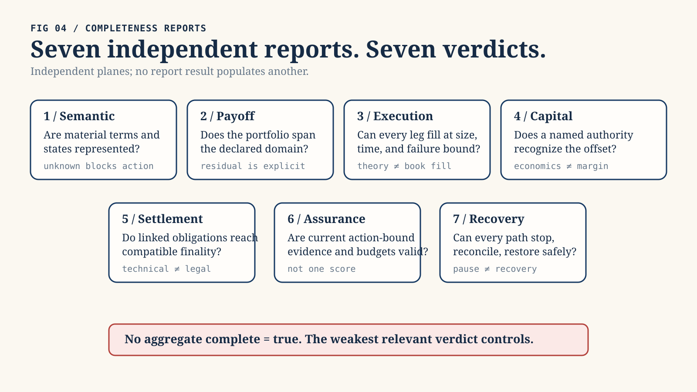
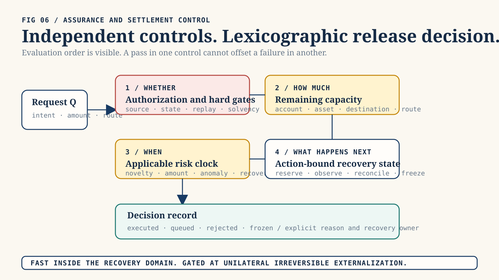

# Product Requirements Document: Statebook

State slice: `statebook-whitepaper-prd-and-publication-media-boundary`.

Status: `DocumentationOnly`.

Evidence ceiling: `Level0DesignNote`.

Version 0.1 — 15 July 2026.

## Problem Statement

Financial venues increasingly list perpetual futures, event contracts, options,
tokenized claims, compute and energy exposures, and other synthetic products
that reference related economic variables. They remain fragmented across
contract semantics, order books, liquidity, margin, legal rights, oracles,
collateral, finality, and security domains.

Users currently lack one auditable system that can answer, without overstating
the result:

1. whether two contracts describe the same material state;
2. whether a target terminal payoff can be replicated over a declared domain;
3. whether every required leg is executable at the claimed size, price, and
   time;
4. whether a recognized authority grants collateral or margin relief;
5. whether linked obligations can reach compatible technical, economic, and
   legal finality;
6. whether current evidence supports the proposed release of value; and
7. whether every path can be stopped, reconciled, recovered, and safely reopened
   after failure.

Current interfaces often compress these questions into a ticker match, an
estimated hedge, a route quote, a portfolio-margin number, a signer quorum, or a
generic “settled” label. This creates false equivalence and hidden residual risk.
The security failure is especially acute when a newly created or disputed claim
becomes immediately withdrawable, borrowable, bridgeable, or reusable as
collateral before anomaly detection and intervention can occur.

The product must preserve fast valid internal risk updates and genuinely atomic
linked settlement while bounding unilateral irreversible externalization. It
must not use a scalar trust score, because strong reputation or identity cannot
compensate for a failed oracle, invalid action authorization, stale solvency
evidence, replay risk, or unresolved finality.

## Solution

Build Statebook as a semantic and risk-coherence platform over federated source
books. The initial product is a read-only terminal and API backed by deterministic
local analysis. It ingests bounded contract terms, binds their provenance,
normalizes them into validated terminal-payoff semantics, derives versioned
StateKeys, compares candidate portfolios, reports exact residuals, and presents
seven independent completeness dimensions:

1. semantic completeness;
2. payoff completeness;
3. execution completeness;
4. capital completeness;
5. settlement completeness;
6. assurance completeness;
7. recovery completeness.

The product also includes a non-authoritative simulator for assurance-adjusted
externalization. Hard gates decide whether externalization is eligible.
Simultaneous native and conservative common-numeraire exposure budgets decide
how much may release immediately. The maximum applicable risk clock decides the
minimum challenge window. A persisted queue, exactly-once ledger, scoped circuit
breakers, and recovery workflow determine what happens next.

The initial product never trades, signs, pauses a venue, holds assets, grants
margin relief, or settles value. AI may propose source mappings, portfolio
candidates, scenarios, and explanations. Deterministic validation and human-
governed policy remain authoritative.



*Figure 1. The product reports seven independent dimensions rather than a single completion score. Original explanatory architecture illustration; not evidence of implementation, authority, or market fact.*

## Product Principles

1. Same reference is not same contract.
2. Mathematical replication is not executable replication.
3. Economic offset is not recognized capital relief.
4. Technical transfer is not automatically legal finality.
5. Evidence maturity for one property cannot substitute for another property.
6. Unknown remains unknown and fails closed where value can externalize.
7. Atomic linked exchange and delayed unilateral externalization solve different
   risks and may coexist.
8. Internal loss recognition and collateral protection remain fast when valid.
9. Pending or anomalous value has zero reusable financial value.
10. Every consequential decision is digest-bound, reproducible, and explicitly
    non-authoritative until a separate authority consumes it.



*Figure 2. Hard gates, budgets, clocks, and state transitions are non-substitutable controls; a failure on one cannot be compensated by another. Original explanatory architecture illustration; not evidence of implementation, authority, or market fact.*

## Users and Jobs

- **Trader or treasury analyst:** identify related exposures and quantify the
  residual rather than relying on product labels.
- **Structurer:** compose bounded terminal claims and disclose unsupported states.
- **Execution lead:** determine whether a theoretical portfolio can actually
  fill all legs.
- **Clearing or margin officer:** evaluate whether an offset is recognized by a
  named authority and under which model.
- **Risk and security operator:** govern current assurance, release budgets,
  challenges, freezes, and recovery.
- **Legal or compliance reviewer:** inspect benchmark, jurisdiction, finality,
  dispute, and enforceability differences.
- **Auditor or regulator:** reproduce decisions from immutable inputs and exact
  policy versions.
- **Venue or data integrator:** add a bounded source adapter without acquiring
  execution or settlement authority.
- **Researcher:** replay market, security, and macro scenarios deterministically.
- **AI agent:** propose mappings and scenarios without executing or relaxing
  policy.

## User Stories

### Contract sources and provenance

1. **As a source curator, I can register a source contract with its venue
   namespace, source identifier, observed revision, observation time, and terms
   digest so that later analysis cannot detach semantics from the source.**
   Acceptance: every record has a stable source identity; missing digest or
   revision rejects registration; the original source remains retrievable or is
   explicitly marked unavailable.

2. **As a source curator, I can classify a source as scholarly, standard, legal,
   code, venue documentation, direct artifact, first-party statement,
   independent analysis, reporting, or illustrative media.**
   Acceptance: class is mandatory; permitted inferences and limitations are
   displayed; illustrative media cannot enter an assurance calculation.

3. **As a reviewer, I can see publication time, retrieval time, stable URL or
   pinned commit, content digest where captured, author, publisher, and license
   or quotation basis.**
   Acceptance: missing provenance is visible; a mutable source is marked as
   mutable; current documentation is not represented as an incident-time
   archive.

4. **As an auditor, I can see exactly which claims each source supports and does
   not support.**
   Acceptance: every source has supported-claim and limitation fields; a venue
   statement cannot be silently treated as independent validation.

5. **As a security reviewer, I can distinguish a direct transaction artifact,
   pinned code observation, official incident statement, preliminary third-
   party hypothesis, and final postmortem.**
   Acceptance: the classes cannot be collapsed; preliminary root-cause claims
   remain visibly preliminary; later sources can supersede without deleting
   history.

6. **As a source curator, I can revoke or supersede a source revision without
   mutating historical decisions.**
   Acceptance: new decisions use the active revision; historical records retain
   the old digest and status; supersession triggers affected-analysis discovery.

### Contract normalization

7. **As a product analyst, I can lower a bounded scalar, terminal, cash-settled
   contract into validated semantics.**
   Acceptance: reference, unit, comparator, observation, payoff, settlement,
   denomination, scale, rounding, and finality fields are mandatory; missing
   material terms reject lowering.

8. **As a reviewer, I can inspect the normalization profile and every source-to-
   semantic mapping decision.**
   Acceptance: profile has a version and digest; implicit defaults are
   prohibited; uncertain mappings remain unknown rather than guessed.

9. **As a benchmark-governance reviewer, I can inspect administrator,
   methodology version, methodology digest, fallback, correction, disruption,
   calendar, and timezone terms.**
   Acceptance: any material mismatch appears as a non-equivalence or residual;
   a shared ticker cannot override it.

10. **As a legal reviewer, I can inspect governing-rule, dispute, default,
    settlement deadline, settlement asset, and finality-domain terms separately
    from economic payoff.**
    Acceptance: absent legal information remains unknown; legal equivalence is
    never inferred from payoff equivalence.

11. **As a source integrator, I can validate fixture-backed source documents
    before a generic adapter abstraction exists.**
    Acceptance: the first phase uses explicit profiles and functions; a source-
    adapter trait is not introduced until at least two real, independently
    reviewed source implementations require it.

12. **As an auditor, I can prove that normalized semantics retain the source
    terms digest and profile version.**
    Acceptance: removing or changing either invalidates the normalized record;
    no unbound normalized contract can enter analysis.

### State identity

13. **As a trader, I can see a versioned StateKey that identifies the exact
    terminal state and settlement semantics, not merely an asset symbol.**
    Acceptance: the key includes a domain tag and schema version; the canonical
    preimage is inspectable; material term changes change the key.

14. **As an implementer, I can use golden StateKey vectors and an independent
    checker.**
    Acceptance: two independent implementations agree byte-for-byte; standard
    hash vectors pass; platform, locale, map order, and source serialization do
    not change identity.

15. **As a reviewer, I can see when two contracts have different StateKeys but
    remain related.**
    Acceptance: relations use typed reasons; related never means exact; the
    report lists every differing material term.

16. **As a reviewer, I can see explicit non-equivalences and unsupported terms.**
    Acceptance: unsupported semantics cannot be dropped; they block exact status
    when relevant; the UI does not hide them behind an advanced view.

### Payoff and residual analysis

17. **As a structurer, I can define a target terminal payoff and a candidate
    portfolio with exact rational coefficients.**
    Acceptance: floating-point quantities, implicit scales, saturating
    arithmetic, and implicit rounding are rejected.

18. **As a trader, I can see the residual in every declared terminal state.**
    Acceptance: `Exact` requires zero residual in every supported state and no
    unsupported states; unknown or unbounded states cannot collapse to zero.

19. **As a risk analyst, I can see worst-case, scenario, basis, timing, FX,
    default, legal, liquidity, jump, and model residuals.**
    Acceptance: every residual includes units and assumptions; unsupported
    residual classes remain visible; no point estimate is labeled exact.

20. **As a trader, I can permute portfolio legs without changing the result.**
    Acceptance: ordering is irrelevant to payoff algebra; duplicate-leg
    aggregation is deterministic; overflow or scale mismatch fails closed.

21. **As a researcher, I can compare a target against several candidate
    portfolios and rank them by declared residual objectives.**
    Acceptance: ranking exposes objective weights; it cannot hide unsupported
    states; the lowest modeled residual is not labeled the safest route.

22. **As a reviewer, I can see every price, quantity, fill, and valuation
    observation used by an approximate result.**
    Acceptance: source and time are mandatory; stale or missing valuation data
    blocks common-numeraire conclusions; rounding is conservative.

23. **As a perpetuals trader, I can see a perpetual as a continuing hedge
    profile rather than a terminal claim.**
    Acceptance: funding, mark, collateral, liquidation, pause, oracle, exit, and
    roll assumptions remain explicit; no terminal equivalence is granted without
    an explicit close or roll rule.

### Typed completeness

24. **As any reviewer, I receive seven independent completeness results rather
    than one complete boolean.**
    Acceptance: semantic, payoff, execution, capital, settlement, assurance,
    and recovery dimensions have separate typed statuses; the weakest relevant
    result controls the claim.

25. **As a product analyst, I can see semantic completeness and its missing
    terms.**
    Acceptance: unknown required fields produce `Incomplete` or `Unknown`; a
    display label or manually asserted mapping cannot produce `Exact`.

26. **As a structurer, I can see payoff completeness over an explicit state
    domain and tolerance.**
    Acceptance: tolerance is versioned and visible; approximate and exact are
    distinct; unsupported states block exact status.

27. **As an execution lead, I can see executable quantity, price bound, time
    bound, fees, depth, slippage, atomicity, queue position, and leg-failure
    model.**
    Acceptance: theoretical payoff coverage cannot populate execution fields;
    absent book data returns `NotObserved`.

28. **As a clearing officer, I can see whether a named authority recognizes the
    offset.**
    Acceptance: report names eligible account, model, haircut, margin rule,
    jurisdiction, and effective time; Statebook cannot grant recognition.

29. **As a settlement reviewer, I can see source observation, source finality,
    destination observation, destination finality, operational reconciliation,
    and legal finality separately.**
    Acceptance: one state cannot imply the next; pending or disputed states
    remain visible; reversal and insolvency rules are attached.

30. **As a security operator, I can see assurance completeness by property and
    dependency root.**
    Acceptance: every required property resolves to pass, fail, or unknown;
    issuer names do not establish independence; wrong-property evidence cannot
    substitute.

31. **As a recovery lead, I can see whether all externalization paths can be
    stopped, every in-flight item reconciled, evidence preserved, liabilities
    restored, and the system reopened through canary limits.**
    Acceptance: missing path coverage produces incomplete recovery; a pause
    switch alone is insufficient; recovery status never implies financial
    solvency.

### Execution and capital evidence

32. **As an execution lead, I can load a time-bound hermetic book snapshot and
    test all-leg feasibility.**
    Acceptance: snapshot provenance and time are bound; partial fills, fees, and
    slippage are modeled; results expire with the declared time bound.

33. **As a route analyst, I can propose an all-or-none linked execution plan.**
    Acceptance: every leg binds asset, amount, direction, account, destination,
    route, deadline, finality, and budget axes; fewer than two legs or absence of
    either direction rejects the plan.

34. **As a risk reviewer, I can see gross outbound exposure without same-action
    inbound netting.**
    Acceptance: every outbound leg consumes all applicable native and common
    caps; inbound value does not create capacity in the same operation.

35. **As a clearing integrator, I can attach a time-bound authority statement
    without changing the economic residual.**
    Acceptance: economic and recognized offsets remain separate; revoked or
    expired recognition changes capital completeness only.

### Assurance evidence

36. **As an evidence provider, I can submit a normalized observation with
    issuer, subject, property, scope, nonce, issue and expiry time, trust roots,
    policy version, source references, and dependency roots.**
    Acceptance: incomplete binding is rejected; unknown dependencies remain
    unknown; the provider receives no settlement authority.

37. **As a policy owner, I can require independent quorum by ultimate root rather
    than vendor count.**
    Acceptance: two services sharing cloud, KMS, RPC, data, CI/CD, model, or
    operator roots can count as one; the dependency graph is auditable.

38. **As a verifier, I can detect stale, replayed, superseded, revoked, or
    equivocated evidence.**
    Acceptance: any such condition fails or becomes unknown according to policy;
    consumed evidence cannot authorize a second action.

39. **As an HSAI integrator, I can map relevant ClaimEnvelope facts into the
    Statebook observation model without inventing missing market properties.**
    Acceptance: missing facts remain unknown; evidence maturity is preserved;
    the adapter states that it does not prove price, solvency, semantics,
    legality, execution, or finality.

40. **As an auditor, I can reconstruct the active evidence snapshot and policy
    exactly as of decision time.**
    Acceptance: roots, revocation, supersession, freshness, quorum, policy
    digest, and clock are retained; later evidence cannot rewrite history.

### Assurance-adjusted externalization

41. **As a treasury operator, I can classify a proposed transition as internal
    risk state, atomic linked exchange, external risk-reducing obligation,
    external unconditional release, or systemic/exceptional.**
    Acceptance: classification is deterministic and fail-closed; unknown becomes
    systemic/exceptional; class never removes applicable gates or caps.

42. **As a policy owner, I can define noncompensable hard gates.**
    Acceptance: failed or unknown authorization, oracle, calculation, state,
    solvency, destination, anomaly, independence, semantic, replay, or finality
    gates produce zero instant release; reputation cannot compensate.

43. **As a user, I receive permitted instant amount, queued amount, required
    delay, binding gates, binding budget axes, policy version, and reason codes.**
    Acceptance: the ratio is an output of current policy and amount, not a
    probability of correctness; every result is reproducible.

44. **As a policy owner, I can use named assurance tiers only after every hard
    gate passes.**
    Acceptance: requirements and caps are explicit; no continuous hidden score;
    anomalies tighten immediately and clean history relaxes only through policy.

45. **As a security operator, I can enforce simultaneous account, linked-
    entity, asset, market, StateKey, destination, venue, route, dependency-root,
    class, and system loss budgets.**
    Acceptance: one atomic reservation consumes all axes; splitting cannot
    expand aggregate allowance; stale common-numeraire valuation fails closed.

46. **As a user, my newly created, pending, disputed, or anomalous PnL cannot be
    withdrawn, borrowed against, bridged, transferred, reused as margin, or used
    to replenish release budgets.**
    Acceptance: reusable value is exactly zero until `ReuseFinality` passes all
    of source-finality profile, independently recomputed economic payoff/PnL,
    operational reconciliation and availability, applicable legal entitlement
    and reversal rules, and absence of a live challenge, anomaly, freeze, or
    solvency failure. Technical inclusion or source finality alone never unlocks
    reuse. Unknown or undeclared dimensions fail closed. Independent prefunding
    remains separately tracked and still consumes caps.

47. **As an operator, I can allow a truly atomic DvP/PvP plan to remain fast.**
    Acceptance: every leg passes all gates, is prefunded and unencumbered,
    all-or-none and exactly-once behavior is enforceable, and gross outbound
    exposure fits every cap; otherwise no leg executes.

48. **As a clearing operator, I can expedite a narrowly defined risk-reducing
    obligation.**
    Acceptance: beneficiary, restricted account, asset, amount, deadline,
    validity, prefunding, finality policy, and before/after exposure are fixed;
    independently recomputed exposure strictly decreases; a general
    withdrawable venue credit rejects.

49. **As a policy owner, I can define required delay as the maximum applicable
    action, novelty, authorization-change, oracle, amount, instrument, route,
    finality, legal, incident, and policy-cooldown clock.**
    Acceptance: delays are not averaged; absent required watcher coverage blocks
    the corresponding instant lane; deployment constants remain policy data.

50. **As a ledger operator, I can reserve exposure exactly once before any side
    effect.**
    Acceptance: mutation compares one expected tip; one concurrent transition
    succeeds. A domain-separated, canonically encoded immutable intent digest
    binds schema version, subject, source account, destination, route, asset,
    direction, total amount, StateKey or financial basis, originating
    transition, linked-plan or obligation digest, action authorization, declared
    release class, nonce, request time, and expiry. A separate decision-context
    digest binds the intent to evidence snapshot, valuation profile, policy, and
    evaluation time. A release-attempt digest binds one release part, decision
    context, and reservation. Same intent id with a different immutable digest
    rejects. Fresh context creates a new attempt under the same parent intent;
    only one live or submitted attempt exists per part, and retries preserve the
    external idempotency key. Independent golden vectors verify all preimages and
    digests.

51. **As an operator, I cannot free in-flight capacity merely because a request
    timed out or a client reported failure.**
    Acceptance: destination finality atomically moves exposure from `in_flight`
    to `consumed` without restoring capacity. Capacity returns only through the
    deterministic refill transition. Independently validated no-outflow evidence
    may remove a reservation or in-flight debit; ambiguous state remains in
    flight.

52. **As a policy owner, I can refill budgets through deterministic sequential
    epochs.**
    Acceptance: refill is capped, oldest eligible exposure is processed first,
    missed epochs cannot be backfilled, lower successor limits never erase
    exposure, and negative or inconsistent counters reject.

### Queue, challenge, circuit breaking, and recovery

53. **As a user, I can distinguish queue state, transfer state, and legal
    finality without ambiguous “settled” shorthand.**
    Acceptance: one `ReleaseRequest` owns a total amount and independently
    identified `ReleasePart` records. Every part binds its amount, queue status,
    transfer status, and optional reservation id. No amount belongs to two
    parts, and
    consumed, reserved, in-flight, queued, cancelled, and remaining amounts
    reconcile exactly to the parent. `QueueStatus` is separately typed as
    `None`, `Queued`,
    `Challenged`, `EvidenceExpired`, `Frozen`, `Cancelled`, or
    `RevalidationRequired`; `TransferStatus` is `Unreserved`, `Reserved`,
    `Submitted`, `SourceObserved`, `SourceFinalized`, `DestinationObserved`,
    `DestinationFinalized`, `Consumed`, or `ProvenNoOutflow`. A revalidated
    request transitions to `Reserved`, never directly to released. Legal
    finality is separately attached, and same-domain coalescing requires an
    explicit finality adapter. Reservation id is absent for `Unreserved` and
    required for every later transfer status, including `ProvenNoOutflow`.
    `Queued`, `EvidenceExpired`, `Cancelled`, and `RevalidationRequired` require
    `Unreserved`; `Challenged` and `Frozen` block new reservation and submission
    side effects but never observation, finality, no-outflow proof, or
    reconciliation of an already submitted transfer;
    `Consumed` and `ProvenNoOutflow` require queue status `None` and are terminal.
    Timer passage alone cannot release.

54. **As an independent watcher, I can submit a bounded evidence-backed
    challenge.**
    Acceptance: challenge grammar, trust roots, deadline, affected scope, and
    response path are explicit; spam cannot become arbitrary permanent veto.

55. **As a user, I can replace a destination or cancel a queued request without
    bypassing review.**
    Acceptance: an immutable economic or authorization change creates a new
    parent intent and digest. Fresh evidence, valuation, or policy creates a new
    decision context and attempt for the same unchanged intent. A queued claim
    cannot be freely transferred unless that transfer is itself treated as
    externalization.

56. **As a security operator, I can tighten one affected product, path, asset,
    StateKey, destination, source, oracle, or dependency root without freezing
    unrelated internal risk controls.**
    Acceptance: breaker scope, trigger, evidence, TTL, renewal ceiling, authority,
    safe exits, pending obligations, audit, and appeal are mandatory. Allowed
    edges are `Normal -> Guarded | Halted`,
    `Guarded -> Challenged | Halted | Resolution`,
    `Challenged -> Guarded | Halted | Resolution`,
    `Halted -> Resolution`, `Resolution -> Recovery`, and
    `Recovery -> Normal | Guarded | Halted`; there is no direct
    `Halted -> Normal` transition.
    TTL or cumulative-renewal exhaustion enters `Resolution`, never automatic
    release, silent renewal, or indefinite limbo. Resolution declares
    entitlement-based safe exits, insolvency priority, adjudication authority,
    and pending-obligation treatment.

57. **As a governance reviewer, I can ensure risk tightens quickly and relaxes
    slowly.**
    Acceptance: adverse evidence can reduce caps immediately; relaxation
    requires resolution evidence, dwell, clean epochs, independent approval,
    timelock, shadow replay, and a successor policy digest.

58. **As a recovery lead, I can pause every externalization path while preserving
    read-only evidence and necessary internal loss recognition.**
    Acceptance: every `ReleaseClass`, profitable-close payout, liquidation
    surplus, LP withdrawal, collateral withdrawal, linked-exchange outbound leg,
    risk-reducing-obligation endpoint, bridge, administrative transfer,
    emergency route, transferable queued claim, borrowing path, margin-reuse
    path, and internal-credit monetization path is inventoried. Any uncovered
    path makes recovery incomplete.

59. **As a recovery lead, I can reconcile every reservation and external receipt
    at source and destination before reopening.**
    Acceptance: duplicate and orphaned liabilities are detected; missing newest
    journal entries block release; timeout is not treated as nonexecution.

60. **As a governance reviewer, I can reopen through low-cap canary stages.**
    Acceptance: affected roots are rotated, incident and adversarial suites pass,
    clean finalized history accumulates, cap increases are gradual, and residual
    risks are published.

### Simulation, audit, AI, and usability

61. **As a researcher, I can run deterministic scenarios over venue, oracle,
    bridge, finality, attacker, policy, liquidity, legal, and macro events.**
    Acceptance: plan binds seed, clock, schedule, versions, and initial state;
    identical inputs yield byte-identical reports.

62. **As a researcher, I can sweep several policies and receive minimal
    counterexample traces.**
    Acceptance: every failure names the violated invariant; no winning policy is
    labeled production calibrated; keep-or-reject decisions use declared metrics.

63. **As an auditor, I can export a portable digest-bound report bundle and
    validate it after readback.**
    Acceptance: missing, extra, traversing, symlinked, stale-digest, malformed,
    or semantically inconsistent content rejects; in-memory success is not
    enough.

64. **As an auditor, I can see contract, StateKey, residual, completeness,
    evidence, policy, valuation, linked-plan or obligation, queue, budget, and
    nonclaim records in one trace.**
    Acceptance: every record binds its input digests and version; no report
    claims live execution or settlement without external evidence.

65. **As an AI agent, I can propose a mapping, portfolio, source classification,
    scenario, or explanation.**
    Acceptance: proposals are labeled and reviewable; AI cannot execute, sign,
    release, change trust roots, clear challenges, or relax policy.

66. **As a security operator, I can ingest bounded anomaly-detector evidence
    without giving a model authority.**
    Acceptance: proposal agents cannot mutate state. A separately identified and
    validated anomaly detector emits evidence only. Deterministic pre-authorized
    policy may map that evidence to a fixed-scope, fixed-TTL protective
    transition. No model selects caps, scope, TTL, renewal, policy, release,
    challenge resolution, or reopening; a false negative cannot authorize
    release.

67. **As a reader, I can view original diagrams and teaching memes with source
    and evidentiary labels.**
    Acceptance: media is accessible, original, and separately manifested;
    diagrams and memes are explanatory only and never evidence inputs.

68. **As an accessibility user, I can understand every status without relying
    on color alone.**
    Acceptance: text, symbols, descriptions, keyboard navigation, contrast, and
    machine-readable reasons are provided; equations have prose explanations.

69. **As a privacy reviewer, I can minimize identity, attestation, entity-link,
    and behavioural data.**
    Acceptance: evidence is purpose-limited, retention is declared, reports can
    disclose digests without unnecessary raw personal data, and access is
    audited.

70. **As an operator, I can observe service health without confusing uptime with
    correctness.**
    Acceptance: metrics separate availability, stale data, unknown state,
    rejected actions, challenged actions, reconciliation mismatches, root
    concentration, and decision reproducibility.

## Implementation Decisions

### ID-001 — Bounded terminal domain first

The first code phase supports scalar, cash-settled, terminal, fixture-backed
contracts. Perpetuals remain a declared path-dependent profile and are excluded
from exact terminal equivalence. Physical delivery, baskets, American exercise,
barriers, path-dependent options, discretionary resolution, and legal
automation remain out of the first domain.

### ID-002 — Separate financial and assurance algebras

`statebook-core` owns terms, StateKeys, payoff, residual, semantic and payoff
completeness, and the common typed-result vocabulary. `statebook-settlement`
evaluates execution, capital, settlement, assurance, and recovery completeness
and owns observations, roots, appraisal, gates, budgets, queue, and decision
records. The transition kernel composes all seven results without allowing
either module to fabricate the other's evidence. HSAI adapters map facts without
embedding financial semantics in ClaimEnvelope or claiming that evidence
maturity proves market truth.

### ID-003 — Opaque validated contract

Only a successful validation-and-lowering operation creates a normalized
contract accepted by the residual engine. The value binds the source digest and
normalization-profile digest. Callers cannot construct a valid contract by
populating public fields.

### ID-004 — Versioned canonical StateKey

The StateKey preimage has an explicit domain tag, schema version, canonical
field ordering, normalized text policy, exact number encoding, and set ordering.
An independent implementation and golden vectors are required. Existing
repository hash types are not aliased because they have distinct semantics.

### ID-005 — Checked exact financial arithmetic

Financial quantities use checked integers, explicit decimal scale, signed
rational coefficients, and declared rounding. Floating point, saturation,
implicit currency conversion, and release-favouring rounding are prohibited.

### ID-006 — Seven typed completeness results

There is no aggregate complete boolean. Each result includes a typed status,
evidence digests, assumptions, missing facts, expiry, and residuals. Semantic or
payoff success cannot populate execution, capital, settlement, assurance, or
recovery success.

### ID-007 — Three linked graphs

The product stores an economic-state graph, an execution graph, and an assurance-
release graph. Relations across graphs are digest-bound. The route optimizer
cannot minimize economic cost while ignoring dependency, finality, liquidity,
legal, or recovery residuals.

### ID-008 — One settlement transition kernel

One pure transition interface coordinates assurance, classification,
conservative valuation, linked-plan or obligation validation, budget reservation,
and queue state. Callers cannot mutate queue and budget separately. The output
is a non-authoritative decision record, not a transfer command.

### ID-009 — Noncompensable assurance gates

Mandatory properties resolve to pass, fail, or unknown. Any required fail or
unknown sets permitted instant release to zero. Named assurance tiers apply only
after all hard gates pass. There is no scalar trust score.

### ID-010 — Ratio as consequence bound

The instant externalization ratio is permitted instant amount divided by
requested amount. It is bounded by current evidence and simultaneous native and
conservative common-numeraire budgets. It is not a probability of correctness
or an actor reputation score. Requested amount must be strictly positive, with
direction encoded separately. Zero, negative, wrong-sign, overflowed, or
noncanonical amounts reject before valuation, gates, reservation, or ratio
calculation.

### ID-011 — Gross all-leg linked exchange

Atomic linked exchange requires at least two legs, both directions, complete
binding, compatible finality, prefunding, no encumbrance, exactly-once behavior,
and all-or-none semantics. Gross outbound legs consume all applicable caps;
inbound legs do not net or refill them.

### ID-012 — Narrow risk-reducing obligation

Expedited external obligations are fixed-beneficiary, fixed-account, fixed-
asset, fixed-amount, fixed-deadline, prefunded, restricted, and independently
shown to reduce exposure. A general withdrawable balance is not risk reducing.
The validated amount is all-or-none.

### ID-013 — Multi-axis event-sourced exposure ledger

The ledger uses one expected-tip compare-and-swap transition, exactly-once
request and reservation ids, append-only history, reservations, in-flight
exposure, consumed exposure, and deterministic capped refill. It never uses a
resettable midnight bucket. Destination finality moves exposure from in-flight
to consumed without restoring capacity; only refill restores capacity. No
generic cancellation frees ambiguous exposure. A parent `ReleaseRequest` owns
one total amount and independently identified `ReleasePart` records. Every part
binds its amount, queue status, transfer status, and optional reservation. The
reservation reference is absent for `Unreserved` and required for all later
transfer statuses, including `ProvenNoOutflow`. Queued, expired, cancelled, and
revalidation-required parts are unreserved. Challenged or frozen parts cannot
reserve or submit new side effects, but already submitted transfers continue
through observation, finality, no-outflow proof, and reconciliation. Consumed
and proven-no-outflow parts have no queue state and are terminal. No amount may
belong to two parts, and every lifecycle amount reconciles to the parent.

Identity, evaluation context, and release attempt are separate:

```text
intent_digest = H(canonical_encode(
  domain_tag, schema_version, subject, source_account,
  destination, route, asset, direction, total_amount,
  StateKey_or_financial_basis, originating_transition,
  linked_plan_or_obligation_digest, action_authorization_digest,
  declared_release_class, nonce, requested_at, expires_at
))

decision_context_digest = H(canonical_encode(
  intent_digest, evidence_snapshot_digest, valuation_profile_digest,
  policy_digest, evaluated_at
))

release_attempt_digest = H(canonical_encode(
  release_part_id, decision_context_digest, reservation_id
))
```

The encodings are domain separated and covered by independent golden vectors.
The same parent id with a different immutable intent rejects. Fresh context
creates a new attempt under the same intent. Only one live or submitted attempt
exists per part, and retries preserve the external idempotency key.

### ID-014 — Fresh revalidation after time

A challenge window is not an automatic timer release. Final release requires a
fresh decision context over evidence, policy, valuation, and evaluation time; a
new attempt linked to the unchanged intent and release part; fresh cap
reservation; and unchallenged state. Pending value remains non-reusable.

### ID-015 — Scoped breakers and recovery state

Breakers are product- and path-specific, have public reason codes, evidence
digests, TTL, cumulative renewal ceiling, appeal, and pending-obligation policy.
Recovery is persisted separately from assurance and includes all-path stop,
reconciliation, evidence preservation, root rotation, replay, and canary reopen.

```text
Normal     -> Guarded | Halted
Guarded    -> Challenged | Halted | Resolution
Challenged -> Guarded | Halted | Resolution
Halted     -> Resolution
Resolution -> Recovery
Recovery   -> Normal | Guarded | Halted
```

TTL or renewal exhaustion enters `Resolution`; it does not release value,
silently renew, or permit indefinite limbo. There is no direct
`Halted -> Normal` transition.

### ID-016 — Dependency-root independence

Evidence independence is evaluated across ultimate data, operator, cloud, KMS,
RPC, CI/CD, model, and signer roots. Vendor count is not quorum count.

### ID-017 — AI cannot expand or independently exercise authority

Proposal-agent outputs enter a proposal record with model provenance and review
status and cannot mutate state. A separately identified and validated anomaly
detector may emit evidence only. Deterministic pre-authorized policy may map that
evidence to a fixed-scope, fixed-TTL protective transition. No model selects
caps, scope, TTL, renewal, policy, release, challenge resolution, or reopening.

### ID-018 — Readback-validated audit artifacts

Reports are not trusted because generation returned success. Materialized bundles
are read and validated for paths, required and extra files, digests, schema,
semantic consistency, secret retention, visibility, and nonclaims.

### ID-019 — Source abstractions follow evidence

Do not introduce a generic venue or source adapter until two real, separately
reviewed implementations demonstrate the shared interface. The first phase uses
fixtures and explicit normalization profiles to avoid premature abstraction.

### ID-020 — Authority is a separate phase

Live execution, custody, signing, pause, margin recognition, or settlement is
not an extension flag on the read-only product. Each requires an explicit phase,
threat model, legal review, operational proof, loss limit, and owner.

## Functional Requirements

- `FR-001`: register and version source terms with provenance and claim limits.
- `FR-002`: validate and lower bounded terminal contracts.
- `FR-003`: derive and independently verify canonical StateKeys.
- `FR-004`: compute exact and approximate terminal residuals.
- `FR-005`: preserve perpetual path-dependence and operational residuals.
- `FR-006`: emit seven typed completeness reports.
- `FR-007`: ingest hermetic execution, clearing, settlement, and assurance
  evidence without cross-dimension inference.
- `FR-008`: resolve current assurance with root independence, freshness,
  revocation, supersession, replay, and equivocation.
- `FR-009`: classify release paths and enforce noncompensable gates.
- `FR-010`: conservatively value and atomically reserve all budget axes.
- `FR-011`: validate atomic linked exchange and risk-reducing obligations.
- `FR-012`: manage queue, challenge, freeze, finality, and exactly-once states.
- `FR-013`: execute deterministic refill and hysteretic policy changes.
- `FR-014`: evaluate and record recovery completeness.
- `FR-015`: run deterministic scenarios, sweeps, and counterexample reduction.
- `FR-016`: materialize and read back digest-bound audit bundles.
- `FR-017`: maintain source and media provenance without treating narrative as
  evidence.
- `FR-018`: expose human- and machine-readable reason codes and nonclaims.

## Non-Functional Requirements

- Deterministic output for identical versions, inputs, clock, and seed.
- No network, credential, process, or live venue dependency in core tests.
- Exact arithmetic and bounded resource use for the declared state domain.
- Fail-closed parsing for duplicate keys, unknown enums, invalid scales,
  malformed numbers, overflow, Unicode ambiguity, and unsupported versions.
- Accessibility without color-only meaning.
- Privacy-minimized evidence and configurable retention.
- Append-only decision provenance and independent digest verification.
- Explicit performance envelopes; latency never weakens correctness.
- Read-only availability during scoped externalization halts where safe.
- No claim above the weakest input evidence and completeness dimension.

## Testing Decisions

### TD-001 — Golden vectors and independent checkers

Maintain golden canonical preimages and digests for StateKey, normalized
contracts, decision records, intents, policies, queue transitions, and ledger
tips. Verify them with an independent implementation and standard hash vectors.

### TD-002 — Unit and boundary tests

Test every validator, enum transition, scale conversion, rounding direction,
state-domain boundary, comparator endpoint, deadline, freshness interval,
policy gate, budget axis, queue edge, and refill eligibility rule. Reject zero,
negative, wrong-sign, overflowed, and noncanonical release amounts before
valuation, gates, reservation, or ratio calculation. Exhaustively test valid and
invalid queue/transfer/reservation combinations and every `ReuseFinality`
predicate input.

### TD-003 — Property tests

Required properties:

- contract and portfolio order invariance;
- exact rational identities;
- no unsupported state can produce exact payoff status;
- material term changes change StateKey;
- any failed or unknown hard gate produces zero instant release;
- policy tightening cannot increase release;
- added exposure cannot shorten delay;
- rounding never favours release;
- splitting cannot expand aggregate caps;
- exactly one concurrent expected-tip mutation succeeds;
- every partial release partitions the parent amount without overlap or gap;
- only one live or submitted release attempt exists per release part;
- fresh decision context preserves immutable intent identity;
- unreserved parts have no reservation and every later transfer state retains
  one;
- technical or source finality alone cannot unlock pending-value reuse;
- linked plans execute all legs or none;
- inbound value never offsets same-operation outbound budgets;
- timer passage alone never releases;
- ambiguous external state remains in flight;
- destination finality moves exposure to consumed without restoring capacity;
- refill never exceeds eligible current-epoch amount;
- simulation and report serialization are deterministic.

### TD-004 — Adversarial corpus

The minimum corpus includes:

1. reuse one valid oracle report across several same-transaction open-and-close
   cycles, requiring synchronous reservation or consumption before post-
   transaction monitoring;
2. submit one nonce with a different payload;
3. retry before and after process crash;
4. crash after reservation but before submission;
5. crash after submission but before receipt persistence;
6. accept a forged message through an uninitialized default root;
7. submit future, stale, and prepared-earlier evidence;
8. present several vendors sharing one dependency root;
9. split exposure across one hundred linked accounts;
10. create extreme provisional PnL and attempt every reuse path;
11. release immediately before and after a calendar boundary;
12. consume an emergency budget then attempt ordinary capacity;
13. fail one linked DvP leg;
14. label an unrestricted withdrawal as risk reducing;
15. reorganize source state before finality;
16. observe source but not destination finality;
17. exhaust a breaker TTL or cumulative renewal ceiling and require formal
    resolution without release, silent renewal, or indefinite limbo;
18. return high AI confidence while a deterministic gate fails;
19. approve through multiple signers sharing one compromised renderer;
20. provide valid attestation around a semantically wrong price;
21. roll back a reference or policy version;
22. restore from a snapshot missing the latest reservation;
23. change an allowed destination without timelock;
24. fragment assets while common valuation is stale;
25. race cancellation against release;
26. lose watcher, monitoring, or policy services without automatic release;
27. change a major dependency or verifier;
28. corrupt one audit-log replica;
29. replace a benchmark methodology without changing the display ticker;
30. approximate a terminal step with a spread while hiding endpoint residuals.
31. submit valid, invalid, duplicate, censored, and unavailable challenges and
    preserve deterministic queue outcomes;
32. compromise breaker authority and attempt scope widening, malicious renewal,
    selective censorship, and direct halted-to-normal reopening;
33. submit a correctly signed but semantically false oracle report from one
    compromised ultimate root;
34. reach technical finality while destination, operational, or legal finality
    remains pending.

Hard invariant targets are zero duplicate external effects, zero provisional-PnL
reuse, zero budget overshoot, zero partial atomic completion in the model, zero
unreconciled finalized intents, and zero untimelocked policy relaxation.

### TD-005 — Parser and artifact tests

Cover duplicate JSON keys, malformed rational and decimal encodings, integer
overflow, Unicode normalization, unknown versions and enum variants, missing or
extra files, stale digests, path traversal, symlink substitution, raw secret or
response-body retention, mismatched report sections, and tampered nonclaims.

### TD-006 — Fuzzing and mutation tests

Fuzz source-contract and artifact parsers. Mutate reference, comparator,
methodology, time, scale, rounding, settlement, evidence, policy, valuation,
leg, destination, nonce, queue, and ledger-tip fields. Every material mutation
must either change the relevant digest or fail validation.

### TD-007 — Static restrictions

Core and hermetic test surfaces must contain no network clients, credential
access, live venue calls, process spawning, fund-release authority, implicit
floating-point financial arithmetic, or filesystem writes outside bounded
report tests.

### TD-008 — Model and AI tests

Measure mapping precision and recall on a human-reviewed corpus, false-equivalence
rate, unsupported-state detection, explanation completeness, proposal drift,
false-negative safety under deterministic gate failure, false-positive freeze
cost, and shared-model correlation. AI output never becomes an oracle.

### TD-009 — Performance and load tests

Measure state-domain scaling, portfolio size, concurrent reservation contention,
queue throughput, challenge load, report size, and p50/p95/p99 decision latency.
Performance failure may reduce availability. It cannot bypass a gate or weaken
rounding.

### TD-010 — Recovery drills

After material changes, rehearse all-path halt, read-only continuity, signer and
root loss, journal recovery, stale snapshot detection, external receipt
reconciliation, duplicate prevention, policy rollback rejection, canary reopen,
and restored-cap ramp. Record recovery time and recovery point without claiming
production readiness from a local drill.

### TD-011 — Evaluation metrics and falsifiers

Track semantic precision/recall, residual correctness, unsupported-state misses,
execution-feasibility error, false capital recognition, hard-gate bypass,
pending-value reuse, cap split resistance, duplicate effect, partial settlement,
reconciliation mismatch, dependency concentration, challenge accuracy,
legitimate-liquidity cost, recovery latency, and decision reproducibility.

Reject or redesign the product if false equivalence cannot be bounded, legal or
clearing users cannot consume the representation, controls create larger
insolvency risk than they contain, decisions cannot be reproduced, or the
business requires hiding unknowns.

## Delivery Sequence

### P0 — Whitepaper, PRD, sources, and media

Documentation and verified publication artifacts only. No runtime capability.

### P1 — Core semantic fixtures

Implement exact terminal terms, validated normalization, StateKey golden
vectors, and negative fixtures in a separately authorized state slice.

### P2 — Residual engine

Implement exact rational payoff and residual analysis over bounded declared
states. No books, live prices, or execution.

### P3 — Completeness reports

Add hermetic execution, capital, settlement, assurance, and recovery fixtures.
No aggregate boolean and no authority claim.

### P4 — Settlement simulator

Implement pure deterministic assurance, valuation, linked-plan, obligation,
budget, queue, breaker, and recovery transitions. No value moves.

### P5 — Evidence adapters and report bundles

Add narrow HSAI and fixture adapters, portable audit bundles, independent
digest checks, and readback validation.

### P6 — Read-only external sources

After separate authorization, ingest captured or live terms and observations
without trading, signing, or custody.

### P7 — Authority integration

Execution, clearing, custody, pause, signing, margin, and settlement remain
separate products and phases with their own legal, security, operational, and
evidence requirements.

## Out of Scope

The initial product does not implement or claim:

- a universal ontology for every financial or legal contract;
- automatic discovery of true economic equivalence;
- path-dependent derivatives beyond an explicit residual profile;
- live venue execution or order placement;
- custody, wallet signing, key management, or asset control;
- real withdrawal, transfer, bridge, or settlement infrastructure;
- oracle truth or benchmark correctness;
- venue solvency or reserve guarantees;
- legal enforceability or cross-jurisdiction finality;
- clearinghouse margin recognition;
- automated collateral optimization;
- unbounded cross-asset or cross-entity netting;
- a governance token, credit system, or external economic rail;
- global agent identity or uniqueness;
- semantic correctness from attestation, signatures, ZK proofs, or reputation;
- autonomous AI authority;
- a scalar probability that a release is safe;
- empirical production calibration for caps, ratios, delays, or breaker
  thresholds;
- a final Ostium incident root cause or loss figure;
- a claim that mandatory delay would have prevented any named incident;
- treating tweets, podcasts, screenshots, journalism, or memes as assurance,
  price, solvency, finality, or settlement evidence;
- production readiness, full security, SOTA, benchmark evidence, or independent
  reproduction.

## Further Notes

### Current repository boundary

No Statebook financial types or settlement kernel are implemented. The governing
Statebook integration document, this PRD, the whitepaper, source index, original
media, and PDFs remain documentation-only at `Level0DesignNote`. New Statebook
runtime modules require a separately named and authorized implementation slice.

The current admission implementation is a concurrent dirty surface and is not a
stable seam for the first Statebook phase. The future adapter must consume a
completed Statebook decision and its digests. It must not force financial
semantics into an existing generic action proposal.

### Research provenance

The annotated source index separates seminal theory, peer-reviewed research,
standards and law, venue documentation, pinned code, direct incident artifacts,
preliminary analysis, reporting, and illustrative media. All current facts are
observation-time claims as of 15 July 2026.

### Ostium wording boundary

Safe wording is limited to contemporaneous reporting of a first-party
acknowledgement, the onchain event pattern, current documentation, pinned code
observations, and preliminary third-party hypotheses. The original social post
was not independently retrievable or retained during this review and is not a
first-party artifact in this package. Do not claim a compromised signer, final
loss amount, router acceptance of still-future timestamps, or prevention by
delay without a later authoritative postmortem and counterfactual evidence.

### Publication rule

The PRD grants no runtime or external authority. Publishing it to an issue
tracker and applying `ready-for-agent` means the documentation package is
sufficiently specified for a future agent to plan the next separately
authorized phase. It does not authorize that phase by itself.
