# Statebook

## A Coherence Layer for Frontier-Risk Markets

### Assurance-adjusted externalization, capital completeness, and financial infrastructure for the AI economy

State slice: `statebook-whitepaper-prd-and-publication-media-boundary`.

Status: `DocumentationOnly`.

Evidence ceiling: `Level0DesignNote`.

Version 0.1 — 15 July 2026.

This paper is architecture research. It is not investment advice, legal advice,
a product launch, production evidence, incident attribution, or authority to
execute trades, recognize margin, hold collateral, pause a venue, sign a
transaction, or settle value.

## Abstract

Financial venues are converging in product surface while remaining fragmented
in semantics, execution, collateral, law, and settlement. Perpetual futures,
event contracts, options, tokenized claims, compute futures, energy contracts,
and other synthetic exposures increasingly describe different pieces of the
same economic world. An order book can match orders in one instrument. It
cannot determine whether two instruments observe the same state, whether a
portfolio replicates a target payoff, whether all required legs can be filled,
whether a clearing regime recognizes the offset, or whether value can settle
with compatible legal finality.

This paper defines a **Statebook** as a semantic and risk-coherence layer above
federated source books. The Statebook normalizes source terms into a bounded
contract representation, groups contracts by precisely defined paying states,
computes state-by-state portfolio residuals, and reports seven independent
dimensions: semantic, payoff, execution, capital, settlement, assurance, and
recovery completeness. It preserves perpetuals as path-dependent hedge profiles
rather than forcing them into terminal-claim semantics.

The paper also rejects a false binary between trust and instant settlement.
Atomic linked settlement can reduce principal risk. Immediate irreversible
externalization can magnify loss when an oracle, signer, calculation, bridge,
or governance path is compromised. The proposed controller therefore leaves
valid internal risk updates fast, permits all-or-none linked exchange only
under strict conditions, and applies evidence-specific gates, loss budgets,
and challenge windows to unilateral value release. Hard gates decide **whether**
a release is eligible; multi-axis budgets decide **how much**; the maximum of
named risk clocks decides **when**; and a challengeable state machine decides
**what happens next**. No scalar reputation score can compensate for failed
current evidence.

AI accelerates both sides of the design. It creates new hedgeable inputs and
outcomes — compute capacity, power, model performance, data access, chips,
latency, regulation, and labour displacement — while increasing machine-speed
search, persuasion, exploit replication, and correlated automation. The likely
next decade is therefore not simply a larger derivatives market. It is a race
to build a programmable market substrate whose semantic, capital, security,
and legal controls can progress at different clocks without being conflated.

## 1. Executive thesis

The phrase “AWS of finance” is useful only when taken beyond marketing. Amazon
Web Services made computing infrastructure programmable and shifted many users
from owning dedicated capacity to consuming standardized, metered services
[M00]. A financial analogue would expose reusable execution, collateral, risk,
lifecycle, and settlement primitives so that a new market does not require
rebuilding an exchange from zero. Hyperliquid's expanding market-deployment surface, Kalshi's
perpetual-futures specification, Architect's compute-market work, tokenized
securities, and institutional moves toward longer trading hours are current
signals of this convergence [M01-M04, I10-I12]. Jeff Yan's “AWS of finance”
framing is Fortune's attribution of a founder thesis, not independent validation
[X01-X02].

The analogy breaks at the point where finance differs from ordinary cloud
compute:

- Financial state is an entitlement and obligation graph, not merely data.
- A duplicated server request is inconvenient; a duplicated payout can be a
  permanent loss.
- Product semantics are governed by benchmark, legal, calendar, disruption,
  default, and settlement rules.
- Capital offsets depend on an authority's recognized model and enforceable
  netting set, not mathematical correlation alone.
- Settlement finality can be technical, economic, accounting, and legal at
  different times.
- The provider can become the concentrated default, governance, surveillance,
  oracle, and operational-risk domain.

The resulting thesis is narrower and stronger:

> A Statebook is a coherence layer over federated books. It organizes
> instruments by state-dependent payoff, identifies bounded replication
> candidates, exposes residual risk, and reports whether execution, collateral,
> settlement, and assurance conditions actually support the proposed action.

It is not a universal clearinghouse, a price oracle, a legal-equivalence engine,
or an automatic proof that the market is complete.

## 2. Why the order book is insufficient

An order book answers a local question: at what prices and quantities are
participants willing to exchange one identified contract? When instruments
share an economic reference but differ in payoff form, maturity, settlement, or
venue, the important questions move above the individual book [T11A].

Consider three claims involving the same reference variable `X`:

1. a binary contract paying one unit if `X >= K` at time `T`;
2. a call spread spanning strikes around `K` and expiring at `T`;
3. a perpetual position whose mark, funding, collateral, and liquidation evolve
   continuously before and after `T`.

They may express related views. They are not the same contract. The binary may
use a different observation window, benchmark administrator, correction rule,
currency, payout cap, or dispute process. The option spread may approximate a
step payoff only at finite strike width. The perpetual remains path dependent
and can liquidate before the terminal observation occurs. Placing all three in
one interface does not make them one coherent market.

The Statebook problem begins where the order book ends:

- What exact world state causes each claim to pay?
- Which terms are material to identity rather than display metadata?
- Is replication exact, bounded, approximate, or unsupported?
- Can all legs be executed at the claimed size and time?
- Is the offset recognized before liquidation?
- Are settlement rights, finality, and default rules compatible?
- Is the evidence authorizing irreversible release current and independent?

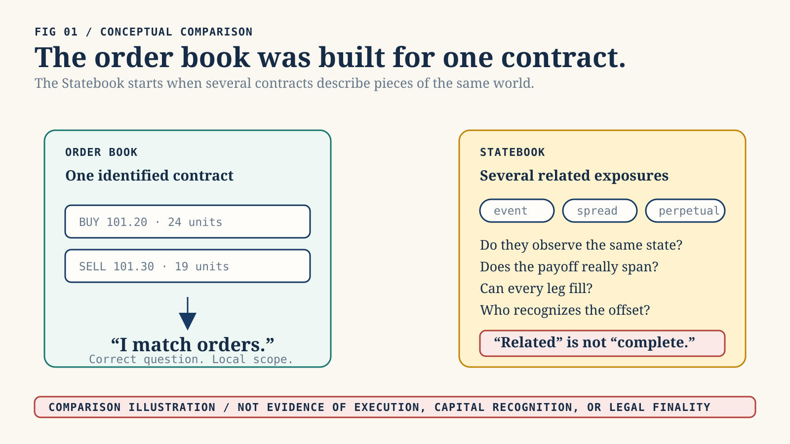

*Figure 1. A local order book matches one identified contract; Statebook keeps semantic, payoff, execution, capital, finality, and recovery gaps visible. Original explanatory architecture illustration; not evidence of implementation, authority, or market fact.*

## 3. Intellectual lineage

### 3.1 State-contingent claims

Arrow and Debreu provide the foundational idea: economic goods and securities
are indexed not only by physical description but by time and the state in which
they are delivered [T01-T02]. Radner explains sequential trading without a
complete date-zero claim set [T02B]. Hart shows that incomplete market
structures can produce constrained inefficiency [T02C]. Duffie and Shafer
establish generic existence of equilibrium in specified incomplete-market
models [T02D].

Statebook adopts the indexing insight but rejects the frictionless conclusion.
Its state identity includes reference methodology, observation interval,
calendar, comparator, settlement asset, rounding, correction, dispute,
default, and finality domain. Two tickers that look alike can represent distinct
states. Two different product labels can sometimes represent related payoffs.
Neither relation is inferred from a name.

### 3.2 Replication and state prices

Black-Scholes, Harrison-Pliska, Ross, and Breeden-Litzenberger establish the
formal relationship among no arbitrage, replication, market completeness, and
state-contingent prices [T03, T04, T05, T05A]. This lineage justifies a payoff algebra. It
also supplies the most important warning: a mathematical replicating strategy
depends on its model, trading set, admissible states, and execution assumptions.

Statebook therefore never equates “same reference” with “same exposure.” Exact
replication is a quantified claim over a declared state domain. Approximate
replication reports the residual and unsupported states. A historical
correlation, model price, or point estimate cannot silently become exact.

### 3.3 Executable contract semantics

Compositional contract languages and ACTUS show that financial terms can be
represented as typed event and cash-flow semantics rather than opaque prose.
Peyton Jones, Eber, and Seward demonstrate compositional financial contracts;
Annenkov and Elsman show verified compilation relative to formalized semantics;
ACTUS defines standardized contract events and cash-flow schedules. FINOS CDM,
FpML, ISO 20022, and the UPI ecosystem supply product, lifecycle, messaging, and
reference-data interoperability [T05B, T05C, T05D, I13, I13A, I13B, I13C].

Statebook should compose with those standards where their semantics fit. It
should not invent an all-purpose replacement ontology. Its differentiated job
is cross-payoff state coherence, residual analysis, completeness typing, and
evidence-bound action proposals.

### 3.4 Microstructure and information markets

Kyle and Glosten-Milgrom explain why execution cost, adverse selection, and
price impact are endogenous [T10-T11]. Hanson demonstrates combinatorial
information markets, and Wolfers-Zitzewitz synthesize prediction-market design
[T13-T15]. Manski supplies a necessary caveat: a binary contract price is not
automatically an objective probability [T13A]. It is a market-implied price whose
probabilistic interpretation depends on beliefs, risk preferences, wealth,
fees, constraints, and design.

The Statebook may expose implied distributions or bounds, but it must retain
those assumptions. It cannot label every event price as a probability or every
apparent arbitrage as executable profit.

### 3.5 Clearing and finality

The PFMI separate legal basis, credit, collateral, margin, liquidity,
settlement, operational risk, links, and default management [I01]. Duffie-Zhu
show that central clearing can either improve or destroy netting efficiency
depending on product scope [I06]. SPAN and STANS demonstrate portfolio-level
risk methods inside governed clearing universes [I08-I09]. CPMI work on DvP,
PvP, fast payments, and tokenisation shows that atomicity and speed have several
effects: linked exchange can reduce principal risk, while immediate gross
settlement can raise prefunding and liquidity pressure
[I02, I02A, I03, I04, I05].

The implication is decisive: payoff similarity alone cannot create capital or
settlement completeness. Those dimensions require recognized authority,
enforceable legal arrangements, operational capacity, and compatible finality.

## 4. Market convergence without coherence

### 4.1 Product forms are becoming primitives

“Prediction market,” “perpetual exchange,” and “options venue” increasingly
describe payoff forms and distribution histories rather than permanent venue
boundaries. Hyperliquid HIP-3 permits builder-deployed perpetual markets with
custom oracles and settlement parameters [M02]. Kalshi publishes a BTC
perpetual specification [M03]. Architect is developing compute-linked products
[M04]. Gnosis Conditional Tokens and Polymarket's negative-risk adapter expose
programmable outcome positions [M05-M07]. CoW Protocol demonstrates solver and
batch-auction infrastructure [M08-M09].

This does not mean every venue will converge technically or legally. It means
users will increasingly encounter the same underlying risk through several
payoff forms and control domains.

### 4.2 Frontier-risk markets

The term **frontier-risk markets** refers here to markets for rapidly emerging,
hard-to-warehouse, or synthetically represented risks whose measurement and
institutional boundaries are still forming. Examples include:

- GPU and accelerator-hour availability;
- data-centre power and congestion;
- grid interconnection and curtailment;
- chip delivery and advanced-packaging capacity;
- model inference price, latency, and service availability;
- benchmarked model capability or failure thresholds;
- data licensing and privacy-regulatory outcomes;
- cyber-loss, oracle, bridge, and protocol risk;
- carbon, weather, catastrophe, and adaptation outcomes;
- election, policy, sanctions, and trade-control events;
- autonomous-agent performance and liability triggers.

These underlyings are heterogeneous. A compute future may reference a benchmark
rather than deliver a specific machine. Power is locational and non-storable.
Model capability benchmarks can saturate or change methodology. Event contracts
may face public-interest restrictions. Statebook's value is not to erase these
differences. It is to make them machine-visible.

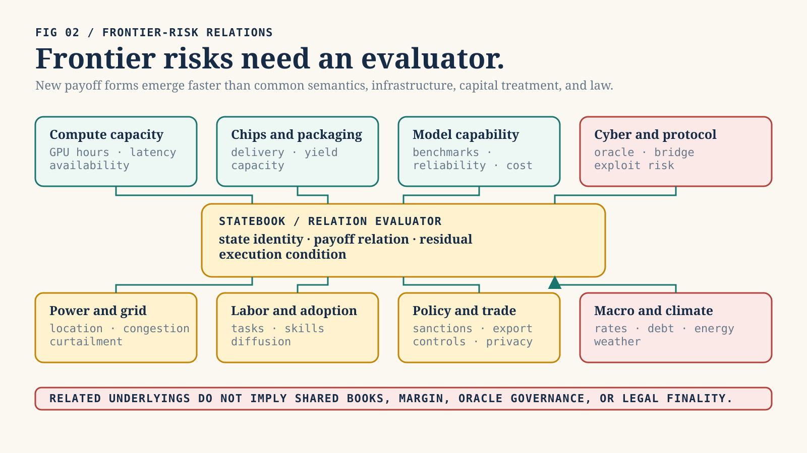

*Figure 2. Frontier-risk categories can share economic references while retaining distinct benchmarks, books, collateral, and legal domains. Original explanatory architecture illustration; not evidence of implementation, authority, or market fact.*

### 4.3 The structured-product implication

Once payoff forms become composable primitives, product design moves from
listing a single contract to assembling state-contingent portfolios. A user
could express “AI infrastructure boom without regional power-price shock,”
“chip-delivery delay conditional on export restriction,” or “model-capability
milestone with downside protected by compute-cost exposure.” This is structured-
product territory.

Combinatorics increase both usefulness and danger. Every added leg introduces
reference, basis, liquidity, default, legal, and settlement dependencies. A
Statebook should make that residual graph explicit before it optimizes routing
or margin.

## 5. The Statebook model

### 5.1 Bounded first domain

The first implementation domain should be intentionally narrow:

- terminal rather than perpetual;
- scalar rather than multidimensional;
- cash settled rather than physical;
- synthetic fixture data rather than live venues;
- exact rational arithmetic rather than floating point;
- deterministic local analysis rather than authority-bearing execution.

This scope is not lack of ambition. It is the minimum domain in which identity,
payoff, residual, and evidence invariants can be falsified without hiding
irreducible path dependence.

### 5.2 Contract normalization

A source contract is lowered through an explicit, versioned normalization
profile. The normalized record binds:

- source venue namespace and contract identifier;
- source terms digest, revision, and observation time;
- economic reference namespace, identifier, unit, administrator, methodology,
  methodology digest, and fallback;
- calendar, timezone, observation window, sampling, disruption, and correction;
- comparator and terminal payoff function;
- settlement asset, scale, rounding, deadline, dispute, default, governing-rule
  reference, and finality domain;
- explicit non-equivalences and unsupported terms.

The normalized value must be opaque to callers until validation succeeds.
Missing material terms reject lowering. The system must never “fill in” a
benchmark, timezone, settlement source, or rounding rule because a similarly
named product usually uses one.

Illustrative pseudo-code:

```text
validated = validate_and_lower(source_terms, normalization_profile)
state_receipt = derive_state_key(validated)
residual = analyze_residual(target, candidate_portfolio, state_domain)
completeness = assess_completeness(residual, books, clearing, settlement, evidence)
```

This is an interface contract, not implemented code.

### 5.3 State identity

The StateKey is a versioned digest over the canonical semantic preimage, not an
asset ticker or free-form label:

```text
StateKey = H(
  domain_tag,
  schema_version,
  reference_identity,
  methodology_and_fallback,
  calendar_timezone_and_observation,
  comparator_and_payoff,
  disruption_and_correction,
  settlement_asset_scale_rounding,
  deadline_dispute_default_and_finality
)
```

Set-like fields require canonical ordering. Material term changes change the
key. Equivalent source serialization does not. Golden preimages and an
independent checker are required before cross-language use. The repository's
existing digest helpers are useful precedents but are not automatically a
cross-language StateKey format.

### 5.4 Payoff and residual algebra

Let `Omega` be the declared set of admissible terminal states, `A` the set of
settlement assets, and `p_i(omega)` the exact asset-vector payoff of contract
`i` in state `omega`. For target payoff `g` and rational quantities `q_i`, the
financial residual is:

```text
r(omega) = g(omega) - sum_i q_i p_i(omega)
```

Exact payoff replication requires `r(omega) = 0` for every supported state and
no unsupported state. Approximate replication reports, rather than hides:

- the evaluated domain and its blind spots;
- worst-case and scenario residuals;
- basis, jump, timing, FX, default, legal, and liquidity residual classes;
- coefficient, quantity, price, fill, and valuation assumptions;
- source time and digest for every observation;
- sensitivity to model and benchmark changes.

Asset conversion uses conservative upper-bound valuation and declared scales.
Overflow, missing prices, stale prices, zero denominators, unrecognized assets,
or ambiguous rounding fail closed. Rounding never increases an allowed release.

### 5.5 Perpetual profiles remain path dependent

A perpetual is not a terminal claim without an expiry. Its cash flows depend on
the entire path of marks, funding, collateral, liquidation, oracle availability,
pauses, position management, and exit timing [T07-T09]. Statebook should model a
perpetual as a continuing hedge profile beside terminal claims. Any conversion
to a terminal exposure requires an explicit close, roll, liquidation, and
funding model. The remaining path residual stays visible.

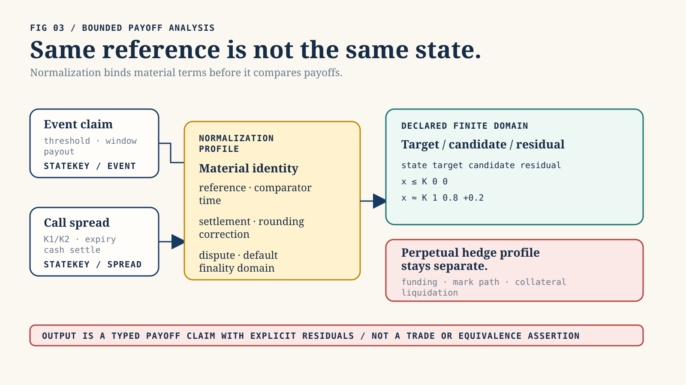

*Figure 3. Normalization binds material terms before a bounded payoff comparison reports target, candidate, and residual; a perpetual remains a separate hedge profile. Original explanatory architecture illustration; not evidence of implementation, authority, or market fact.*

### 5.6 Seven typed completeness dimensions

The initial three-part distinction — product, execution, and capital
completeness — is necessary but not sufficient. The full decision requires
seven typed dimensions:

1. **Semantic completeness:** Are all material terms and relevant states
   represented without unknowns?
2. **Payoff completeness:** Does the candidate portfolio span the target payoff
   over the declared domain within the stated tolerance?
3. **Execution completeness:** Can every required leg fill at the claimed size,
   price, time, and failure bound?
4. **Capital completeness:** Does the governing margin or clearing authority
   recognize the offset before liquidation, with explicit haircut and model?
5. **Settlement completeness:** Can linked obligations reach compatible
   technical, economic, and legal finality?
6. **Assurance completeness:** Are current evidence, authorization, provenance,
   replay, solvency, route, and anomaly requirements satisfied for the proposed
   action?
7. **Recovery completeness:** Can every externalization path stop, every in-
   flight item reconcile, evidence remain available, liabilities restore without
   duplication, and the system reopen through bounded canary stages?


*Figure 4. The seven reports are independent planes, each carrying typed status, evidence references, missing facts, and residuals. Original explanatory architecture illustration; not evidence of implementation, authority, or market fact.*

There is no aggregate `complete = true`. Each dimension returns a typed status,
evidence references, missing facts, and residuals. The weakest relevant
dimension controls the permitted claim and action.

## 6. HSAI and repository integration boundary

This repository already contains useful evidence and assurance patterns:

- `hsai-claim-envelope` distinguishes evidence maturity, predicates, trust
  roots, provenance, conjunction, and acceptance policy.
- `hsai-agent-case` separates declared input from evidence lanes.
- `hsai-attestation` and `hsai-attestation-phala` demonstrate injected
  verifiers, caller-supplied trust roots, normalized outputs, replay protection,
  hermetic doubles, and `Attested`-only claims.
- `hsai-agent-admission` at committed revision
  `b4b644cd96d9b70eb21ff6681a0014245773cd0f` demonstrates proposal, decision,
  reason, digest, quarantine, journal, replay, and no-authority patterns. The
  current dirty working tree remains outside this slice and is not a stable
  Statebook seam.
- `zkbench-core` demonstrates Semantic IR, typed completeness, evidence
  candidates, acceptance, escalation guards, quarantine, deterministic
  artifacts, and explicit Claim Boundaries.

The financial and assurance algebras must stay separate:

```text
Financial algebra:
  terms -> normalized contract -> StateKey -> payoff -> residual -> completeness

Assurance algebra:
  observations -> appraisal -> current evidence -> policy decision -> claim limit
```

HSAI can attest that decision digest `D` passed policy `P` against evidence
snapshot `E` at time `T`. It cannot thereby prove market price, payoff
equivalence, venue solvency, legal enforceability, settlement finality, or
semantic correctness. A higher evidence maturity for the wrong property cannot
substitute for the missing property.

The eventual integration should use a narrow adapter. Financial semantics are
computed before the adapter. The adapter preserves missing information as
`Unknown` and never receives settlement authority. Admission receives a
completed, digest-bound Statebook proposal; it must not reconstruct economic
meaning from a lossy target string and integer amount.

## 7. Assurance-adjusted externalization

### 7.1 The security problem is path coverage

“Kill instant settlement” captures a real intuition: irreversible value release
can turn one incorrect state transition into final loss before detection and
intervention. It is not a sufficient architecture. A mandatory delay protects
only the paths it actually gates. If profitable closes, collateral withdrawal,
bridges, administrative payouts, or internal credit reuse bypass the delayed
withdrawal path, one delayed function creates the appearance rather than the
substance of containment.

The correct scope is every transition that can convert disputed, newly created,
or weakly supported state into spendable value, borrowing capacity, reusable
margin, transferable claims, or external assets.

### 7.2 Three clocks

The architecture separates:

1. **Execution finality:** when a match or state transition becomes irrevocable
   inside the market engine.
2. **Economic settlement:** when balances, collateral, and obligations update
   inside the recovery domain.
3. **Externalization finality:** when value leaves the domain in a way the
   system cannot reliably stop or reverse.

Valid internal risk updates should generally remain fast. Delaying mark,
funding, collateral lock, liquidation, or loss recognition can make a system
less safe. Atomic DvP or PvP should remain available where it truly guarantees
all legs or none. The highest friction belongs on unilateral irreversible
externalization whose evidence or consequence is uncertain.

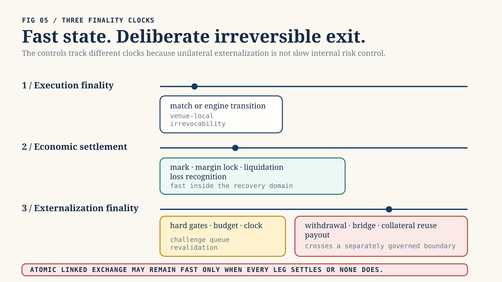

*Figure 5. Execution finality, economic settlement, and externalization finality move on separate clocks; the last receives the strongest control. Original explanatory architecture illustration; not evidence of implementation, authority, or market fact.*


*Figure 6. Evaluation order is lexicographic rather than compensatory: no strong score on one axis can offset a failed hard gate on another. Original explanatory architecture illustration; not evidence of implementation, authority, or market fact.*

### 7.3 Why there is no trust score

A single ratio between “trust” and “instant settlement” is unsafe. It lets
strong identity or history compensate numerically for a failed oracle, stale
authorization, missing solvency evidence, or compromised signer. It also
double-counts correlated sources and turns hidden weights into financial
authority.

The retained controller is lexicographic, not compensatory:

1. **Hard gates determine whether.** Every applicable critical predicate must
   pass. `Unknown` is not `Pass`.
2. **Exposure budgets determine how much.** Native-asset and conservative
   common-numeraire caps bind account, subject, destination, StateKey, oracle
   root, route, dependency, venue, class, and system exposure simultaneously.
3. **Risk clocks determine when.** The required delay is the maximum applicable
   delay, not a weighted average.
4. **The queue determines what happens next.** Time alone never converts an
   invalid request into a valid release.

Reputation can select less friction only inside the current hard envelope. It
cannot bypass it.

### 7.4 Release classes

The controller classifies a transition before calculating a release:

- `InternalRiskState`: valid bookkeeping, marks, funding, collateral locks, or
  liquidation state that remains inside the recovery domain.
- `AtomicLinkedExchange`: an all-or-none, exactly-once exchange in which every
  leg is bound, prefunded, unencumbered, within gross caps, and subject to
  compatible finality. Inbound consideration never replenishes outbound caps
  in the same operation.
- `ExternalRiskReducingObligation`: a fixed-beneficiary, fixed-amount,
  restricted, prefunded obligation whose independently recomputed before/after
  exposure is strictly lower and whose destination cannot be used as a general
  withdrawable balance.
- `ExternalUnconditional`: unilateral value release subject to ratio, caps, and
  queue.
- `SystemicOrExceptional`: novel, concentrated, disputed, or high-impact state
  receiving zero ordinary instant release.

Unknown classification becomes `SystemicOrExceptional`. A class changes timing
and obligation structure. It never creates an uncapped bypass.

### 7.5 Hard gates

Before any instant amount is considered, the system requires current,
request-bound evidence for:

- action and destination authorization;
- source authenticity, freshness, monotonicity, one-time use, and equivocation
  control;
- independent recomputation of PnL, collateral, redemption, or transfer;
- existence and exactly-once identity of the originating state transition;
- reserves, liquid resources, and declared stress support;
- destination, sanctions, route, bridge, and contract-behaviour policy;
- absence of a relevant anomaly, freeze, rollback, compromise, or exhausted
  system loss budget;
- independence of required evidence roots;
- terms digest, StateKey, coherence, and settlement-report binding for
  contract-derived value;
- zero reuse of pending or anomalous PnL;
- exact obligation or linked-plan structure where an expedited class is used.

Any required `Fail` or `Unknown` yields zero instant externalization. The
ordinary queue is not a delayed permission to release invalid value.

Pending or anomalous PnL remains non-reusable until an explicit
`ReuseFinality` predicate passes:

```text
ReuseFinality = AND(
  source_finality_profile_passes,
  payoff_and_PnL_are_independently_recomputed_and_economically_final,
  operational_reconciliation_and_availability_pass,
  applicable_legal_entitlement_and_reversal_rules_pass,
  no_live_challenge_anomaly_freeze_or_solvency_failure
)
```

Technical inclusion or source finality alone never unlocks withdrawal,
borrowing, bridging, transfer, margin reuse, or release-budget value. An unknown
or inapplicable-but-undeclared dimension fails closed.

### 7.6 Dynamic release surface

For request amount `Q`, conservative value `V(Q)`, current assurance tier `t`,
and applicable remaining caps `B_j`, the candidate instant amount is bounded by:

`Q` must be strictly positive. Direction is encoded separately from amount.
Zero, negative, wrong-sign, overflowed, or noncanonical amounts reject before
valuation, gate evaluation, reservation, or ratio calculation.

```text
if any required gate != Pass:
  instant = 0
else:
  common_limit = min(V(Q), tier_cap[t], B_1, B_2, ..., stressed_system_limit)
  native_limit = floor_convert(common_limit)
  instant = min(Q, native_asset_cap, native_limit)

instant_ratio = instant / Q
```

This ratio is an output, not a reputation input. It changes with current
evidence, amount, destination novelty, correlated exposure, system stress,
route, instrument, and policy version. The same actor can receive different
results for different actions at the same time.

If `0 < instant < Q`, the request is partitioned into independent parts:

```text
ReleaseRequest {
  request_id,
  total_amount,
  release_parts
}

ReleasePart {
  part_id,
  amount,
  queue_status,
  transfer_status,
  reservation_id?
}
```

Every instant or queued part has an independent id and lifecycle. No amount may
belong to two parts. Consumed, reserved, in-flight, queued, cancelled, and
remaining amounts reconcile exactly to the parent amount. `reservation_id` is
absent while transfer status is `Unreserved` and required for every later
transfer status, including `ProvenNoOutflow`, so the released reservation
remains auditable.

Atomic linked plans and risk-reducing obligations are all-or-none at the
validated amount. They never degrade into unilateral legs. Splitting one
request across accounts, destinations, blocks, assets, agents, or correlated
venues cannot increase aggregate allowance.

### 7.7 Exactly-once exposure ledger

All applicable counters are checked and reserved in one compare-and-swap
transition against a versioned ledger tip. A request and reservation are
exactly-once. State is:

```text
remaining = limit - consumed - live_reservations - in_flight
```

An immediately final release moves reservation to consumed. A submitted
cross-domain release remains `in_flight` until destination finality is observed.
Destination finality atomically moves exposure from `in_flight` to `consumed`;
it does not restore capacity. Consumed exposure continues to reduce capacity
until the deterministic refill transition. Timeout or reported failure removes
a reservation or in-flight debit only with independently validated proof that
no value left. Otherwise exposure remains counted. There is no generic cancel-
and-release command.

Exactly-once identity is bound by a canonical, domain-separated digest:

```text
intent_digest = H(canonical_encode(
  domain_tag,
  schema_version,
  subject,
  source_account,
  destination,
  route,
  asset,
  direction,
  total_amount,
  StateKey_or_financial_basis,
  originating_transition,
  linked_plan_or_obligation_digest,
  action_authorization_digest,
  declared_release_class,
  nonce,
  requested_at,
  expires_at
))

decision_context_digest = H(canonical_encode(
  intent_digest,
  evidence_snapshot_digest,
  valuation_profile_digest,
  policy_digest,
  evaluated_at
))

release_attempt_digest = H(canonical_encode(
  release_part_id,
  decision_context_digest,
  reservation_id
))
```

Golden vectors independently verify every encoding and digest. The same intent
id with a different immutable `intent_digest` rejects before reservation. Fresh
evidence, valuation, or policy creates a new decision context and release
attempt linked to the same parent intent. Only one live or submitted attempt may
exist per release part. Retries preserve the same external idempotency key.

Refill is a deterministic, capped, sequential epoch transition. It requires
finality, reconciliation, independently closed correlated exposure, clean
epochs, and absence of circular or pending-credit origin. A missed evidence
epoch cannot be backfilled later using today's clean signal.

### 7.8 Challenge queue and hysteresis

```text
QueueStatus =
  None | Queued | Challenged | EvidenceExpired |
  Frozen | Cancelled | RevalidationRequired

TransferStatus =
  Unreserved | Reserved | Submitted |
  SourceObserved | SourceFinalized |
  DestinationObserved | DestinationFinalized |
  Consumed | ProvenNoOutflow
```

These statuses apply per `ReleasePart`. Every release after waiting requires a
fresh decision context and fresh budget reservation. A revalidated queued part
transitions to `Reserved`, never directly to “released.” Legal finality remains
a separate attached status. Same-domain state coalescing requires an explicit
finality adapter. Pending amounts provide zero borrowing, collateral, margin-
reuse, transfer, or release-budget value. Challenges use a bounded evidence
grammar, not arbitrary vetoes.

Valid combinations are constrained. `Queued`, `EvidenceExpired`, `Cancelled`,
and `RevalidationRequired` require `Unreserved` and no reservation id.
`Challenged` and `Frozen` block new reservation and submission side effects.
They never block observation, source or destination finality, no-outflow proof,
or reconciliation transitions for an already submitted transfer. `Consumed`
and `ProvenNoOutflow` require `QueueStatus::None`, retain the reservation id,
and are terminal for that part.

Risk tightens faster than it relaxes. New adverse evidence can reduce caps or
lengthen delays immediately. Relaxation requires resolution evidence,
independent current support, clean epochs, dwell time, timelock, retained-
traffic shadow evaluation, and a new policy digest. Emergency authority may
tighten a bounded lane. It cannot silently increase instant release.

Breaker progression is explicit:

```text
Normal     -> Guarded | Halted
Guarded    -> Challenged | Halted | Resolution
Challenged -> Guarded | Halted | Resolution
Halted     -> Resolution
Resolution -> Recovery
Recovery   -> Normal | Guarded | Halted
```

TTL or cumulative-renewal exhaustion enters `Resolution`. It neither releases
disputed value nor permits silent renewal or indefinite limbo. Entitlement-
based safe exits, insolvency priority, adjudication authority, and pending-
obligation treatment are declared by policy. There is no direct
`Halted -> Normal` transition.

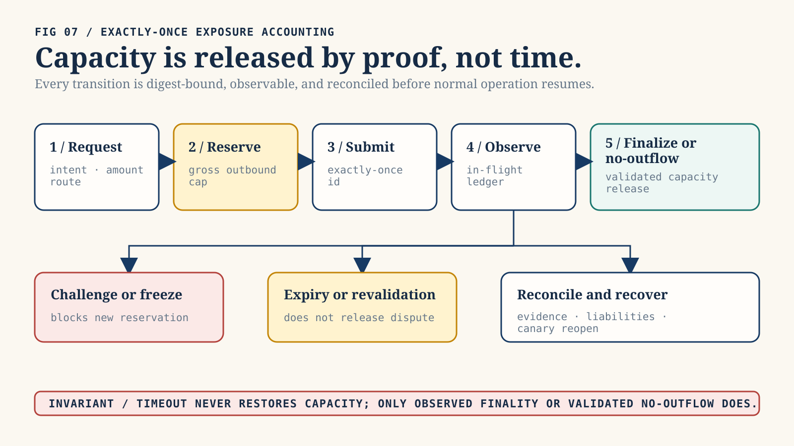

*Figure 7. Capacity remains reserved or in flight until observed finality or a validated no-outflow proof; time alone cannot restore it. Original explanatory architecture illustration; not evidence of implementation, authority, or market fact.*

### 7.9 Control tradeoff

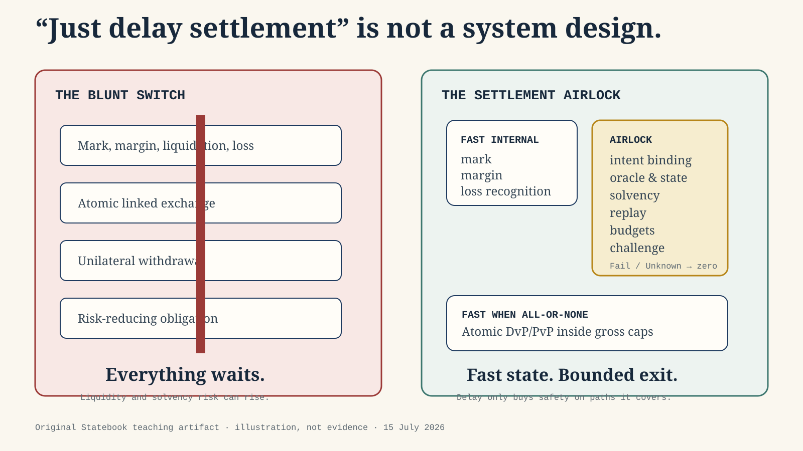

*Figure 8. Fast internal risk updates, all-or-none linked exchange, and gated unilateral externalization are different paths with different controls. Original explanatory architecture illustration; not evidence of implementation, authority, or market fact.*

A delay buys a detection and intervention option. It also creates liquidity,
censorship, custody, governance, and false-positive costs. The objective is not
maximum delay. It is minimum irreversible exposure consistent with market
function, bounded by the slowest credible detection-and-response clock for the
specific action.

## 8. Incident-grounded lesson: Ostium, July 2026

### 8.1 What was observed

Contemporaneous reporting quoted an Ostium X post as stating that the project
was aware of an OLP-vault issue and had paused all trading. The original post
was not independently retrievable or retained during this review; this is
reporting of a first-party statement, not a retained first-party artifact
[S07]. The cited Arbitrum transaction and a preliminary Blockaid analysis
supplied additional early context [S09-S10]. Public documentation described its
oracle, automation, immediate trader-PnL, and LP-withdrawal systems [S11-S12].
Pinned public source paths expose one revision's profitable-close, vault-
transfer, authorization, upkeep, and timestamp checks [S13-S14].

Those materials establish a bounded design lesson, not a final root-cause
finding. The source commit is not asserted to match incident-time deployed
bytecode. One reported official follow-up URL was not independently retrievable
during the second-pass review and is not used for a distinct substantive claim
[S08].
Preliminary social posts may be superseded. The exact loss, recovery, and
counterfactual effect of any delay remain outside this paper's evidence.

### 8.2 What the incident prompt teaches

The salient question is not “did the protocol have a withdrawal delay?” It is
“which paths turned state into externalizable value, and did each path require
current, independently recomputed, request-bound evidence before finality?”

Current Ostium documentation distinguishes a dynamic liquidity-provider
request-and-settle withdrawal flow, typically described as taking days, from
winning-trader PnL paid immediately onchain. That distinction supports the path-
coverage lesson: a delayed LP redemption route does not constrain a separate
profitable-close payout route.

Direct event-log inspection of the cited Arbitrum transaction shows ten price
requests and responses and five open-and-close round trips in one successful
transaction. That establishes an anomalous execution pattern. It does not prove
who compromised what. Preliminary Blockaid analysis alleged involvement of a
registered forwarder and prepared or future-dated authorized reports. The
pinned router code rejects request timestamps that are still later than the
current block, so this paper does not restate the preliminary allegation as
acceptance of a still-future request timestamp.

The correct counterfactual is conditional:

- A challenge window could reduce loss only if the compromised or erroneous
  path entered the window.
- Detection and intervention had to occur before the window closed.
- Pending credit could not be borrowed, transferred, bridged, or reused.
- Emergency controls had to remain available and uncompromised.
- The system still needed safe margin, liquidation, and loss-recognition paths.

Therefore this paper does not claim that mandatory delays would have prevented
the incident. It claims that irreversible path coverage is a first-class
security invariant.

### 8.3 Wider incident evidence

Nomad illustrates how one validation defect can become a copyable machine-speed
loss path [S15]. Bybit's 2025 disclosures and preliminary Verichains analysis
show how
interface and signing-chain compromise can defeat the intuition that a cold
wallet is safe merely because its keys are offline [S16-S17]. These incidents
are architecturally different. Together they demonstrate that “trusted
component” is not a stable security primitive. Every high-consequence action
needs current, intent-bound, independently observable controls.

## 9. Threat model and control coverage

### 9.1 Assets

The system must protect:

- user collateral and settlement assets;
- contract terms and StateKey integrity;
- market, oracle, and benchmark observations;
- margin, exposure, and budget state;
- queued rights and challenge evidence;
- policy, governance, and trust-root configuration;
- signer, relayer, venue, bridge, and finality identities;
- audit records and nonclaims.

### 9.2 Adversaries and failures

The design assumes possible:

- compromised trader, operator, signer, relayer, oracle, benchmark, bridge,
  venue, evidence provider, or governance key;
- malicious or mistaken contract normalization;
- stale, replayed, equivocated, correlated, or transplanted evidence;
- model, arithmetic, scale, rounding, and valuation defects;
- partial linked-leg execution;
- venue insolvency, withdrawal freeze, chain reorganization, or legal stay;
- queue censorship, challenge spam, cap splitting, and policy oscillation;
- AI-assisted exploit search, malformed contract generation, social
  engineering, or coordinated machine-speed withdrawal.

### 9.3 Control map

| Failure domain | Primary Statebook control | Residual risk |
| --- | --- | --- |
| Semantic mismatch | Terms digest, normalization profile, StateKey, unsupported-state reporting | Wrong or incomplete source terms |
| Oracle or benchmark compromise | Multiple current roots, request binding, freshness, equivocation checks, caps, queue | Correlated or governance-level compromise |
| Signer compromise | Intent-bound payload, destination policy, caps, novelty delay, independent watchers | Compromise of all required roots or governance |
| Calculation defect | Independent deterministic recomputation, exact arithmetic, golden vectors | Shared specification bug |
| Replay or concurrency | Exactly-once ids, CAS ledger tip, append-only records | Availability loss under contention |
| Linked-leg failure | All-or-none plan, gross outbound budgets, no inbound netting | External domain violates claimed atomicity |
| Bridge or finality reversal | In-flight accounting until observed finality, no timeout release | Prolonged trapped exposure |
| Insolvency or liquidity stress | Reserve/liquidity gates, stressed system budget, no pending-credit reuse | Evidence can lag sudden insolvency |
| Governance attack | Fast bounded tightening, slow timelocked relaxation, scoped breakers | Malicious threshold coalition or liveness failure |
| AI swarm | Aggregate multidimensional caps, split resistance, queue priority controls | Novel correlated tactics and denial of service |

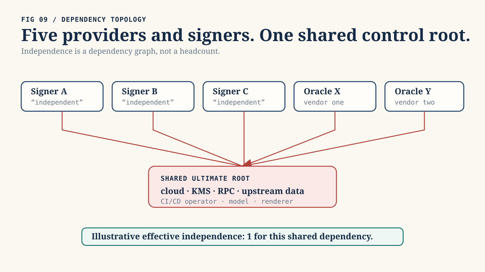

*Figure 9. Reported provider count is not a measure of independent control roots. Original explanatory architecture illustration; not evidence of implementation, authority, or market fact.*

### 9.4 What delays do not solve

Delay does not repair a false oracle, replace solvency, validate legal rights,
prevent a compromised governance majority, create liquidity, guarantee watcher
availability, or make a bridge final. It can worsen margin pressure and
concentrate discretionary control. The queue is one control in a layered system,
not a universal security theorem.

## 10. Capital and legal coherence

### 10.1 Economic offset is not recognized offset

Suppose two positions have nearly opposite payoffs. The holder may still post
gross collateral if they sit in separate accounts, entities, customer
protection regimes, default funds, currencies, legal jurisdictions, or close-out
netting sets. Duffie-Zhu's result means even centralization can reduce one
netting benefit while destroying another [I06].

Capital completeness must name:

- the authority recognizing the offset;
- eligible accounts and legal entities;
- model version, stress scenarios, correlations, concentration add-ons, and
  haircuts;
- collateral eligibility and FX treatment;
- liquidation and default-waterfall rules;
- enforceable close-out netting and insolvency treatment;
- conditions under which the recognition is withdrawn.

A Statebook may calculate an economic residual. It cannot award margin relief
unless the governing authority adopts it.

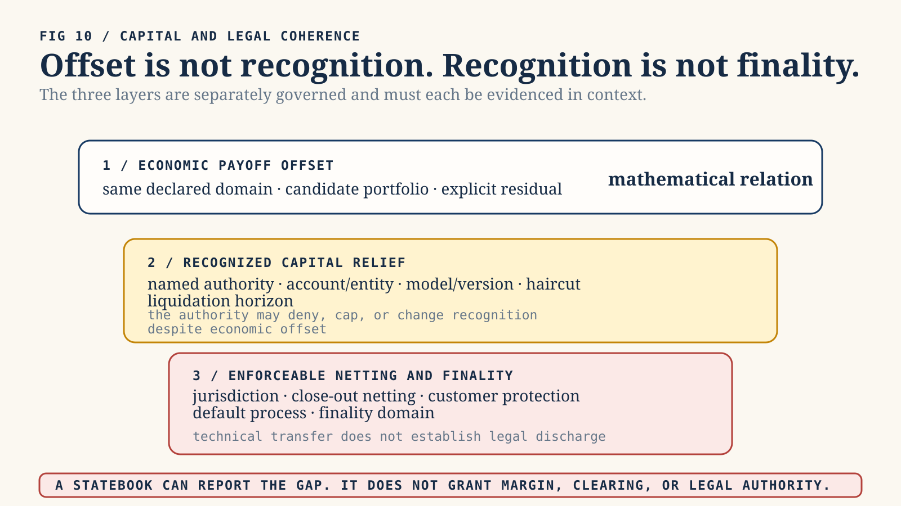

*Figure 10. Economic payoff offset, recognized capital relief, and enforceable netting/finality are separately governed layers. Original explanatory architecture illustration; not evidence of implementation, authority, or market fact.*

### 10.2 Technical and legal finality

A ledger can mark a transfer final while law still permits reversal, stay, or
insolvency challenge. A payment can be irrevocable in one domain while a linked
asset leg remains conditional in another. Statebook settlement reports must
distinguish technical confirmation, economic availability, operational
reconciliation, and legal finality.

### 10.3 Regulatory topology

Product convergence crosses regulatory categories rather than dissolving them.
Event contracts, futures, swaps, options, securities, gaming, insurance,
payments, commodities, and lending can be treated differently by jurisdiction
and participant type. Benchmark governance, market integrity, surveillance,
customer protection, segregation, best execution, disclosures, sanctions,
privacy, and data rights remain separate obligations.

The Statebook should carry legal and authority references as constraints and
unknowns. It should never infer legal fungibility from payoff similarity.

## 11. AI, technology, and the global economy

### 11.1 AI creates both underlyings and market actors

AI affects Statebook through four channels:

1. **Physical demand:** data centres consume electricity, grid capacity,
   cooling, land, networking, chips, transformers, turbines, and capital
   [A01, A04].
2. **Economic productivity:** automation changes costs, labour demand,
   competition, investment, and sectoral output unevenly
   [A05, A05A, A05B, A06, A07].
3. **Financial infrastructure:** models improve normalization, surveillance,
   scenario generation, code analysis, and routing, while creating correlated
   model and third-party risk [A08, A09, I15].
4. **Adversarial capacity:** agents accelerate reconnaissance, exploit
   replication, transaction splitting, synthetic identity, persuasion, and
   congestion. This is a threat-model assumption, not an empirical forecast.

The same system that helps discover a hedge can discover a bypass. Proposal
agents cannot mutate state; they may only suggest mappings, portfolios, tests,
or transactions. A separately identified and validated anomaly detector may
emit evidence only. Deterministic pre-authorized policy may map that evidence to
a fixed-scope, fixed-TTL protective transition. No model selects caps, scope,
TTL, renewal, policy, release, challenge resolution, or reopening.

### 11.2 Physical and institutional bottlenecks

The IEA's 2026 central scenario places data-centre electricity use near 950 TWh
in 2030, roughly double the 2025 level, while emphasizing grids, equipment,
chips, capital, and social acceptance as constraints [A01]. World Bank work
shows that connectivity, compute, context, and competency are distributed
unevenly [A04]. FERC's 2026 large-load action illustrates how AI demand becomes
a grid-governance problem [A04A]. These constraints create potential hedging
demand but also make references locational, methodological, and political.

### 11.3 Productivity is a distribution, not one number

OECD scenarios estimate material annual labour-productivity gains in highly
exposed G7 economies under explicit assumptions [A05]. Field evidence such as
Brynjolfsson, Li, and Raymond finds large gains in a specific customer-support
setting [A05A]. Acemoglu's task framework produces a more restrained aggregate
baseline [A05B]. The correct interpretation is not to choose the most exciting number.
It is to model adoption cost, task exposure, complementarity, diffusion,
competition, energy, and institutional response as uncertain state variables.

### 11.4 Macro crosscurrents

The IMF's July 2026 baseline projects 3.0 percent global growth in 2026 and 3.4
percent in 2027, balancing energy and geopolitical downside against technology
investment [A02]. The World Bank's June 2026 baseline is more conservative at
2.5 percent for 2026 and includes a severe downside scenario near 1.3 percent
[A03]. These are not numbers to average mechanically. They use different
cutoffs, assumptions, and scenario structures.

Statebook-relevant feedback loops include:

- AI capital expenditure raises chip, power, construction, and financing demand.
- Grid and supply constraints raise regional basis risk.
- Higher productivity can improve fiscal capacity but can also concentrate
  rents and widen country or firm divergence.
- Sovereign debt, energy shocks, and geopolitical fragmentation can tighten
  funding precisely when infrastructure investment needs rise.
- Tokenization and 24/7 markets can accelerate collateral movement while
  increasing operational and liquidity demands.
- Common AI, cloud, oracle, and data providers create correlated failure roots.
- Automated risk reduction can become synchronized deleveraging.

### 11.5 Progress occurs at different clocks

Software capability can improve weekly or monthly. Hardware capacity expands
over quarters and years. Transmission grids, power plants, permitting,
standards, clearing arrangements, and law move over years or decades. A coherent
market substrate must expose these mismatched clocks rather than assuming that
software speed removes physical or legal latency.

### 11.6 Two-, five-, and ten-year scenario envelope

These are scenarios, not forecasts.

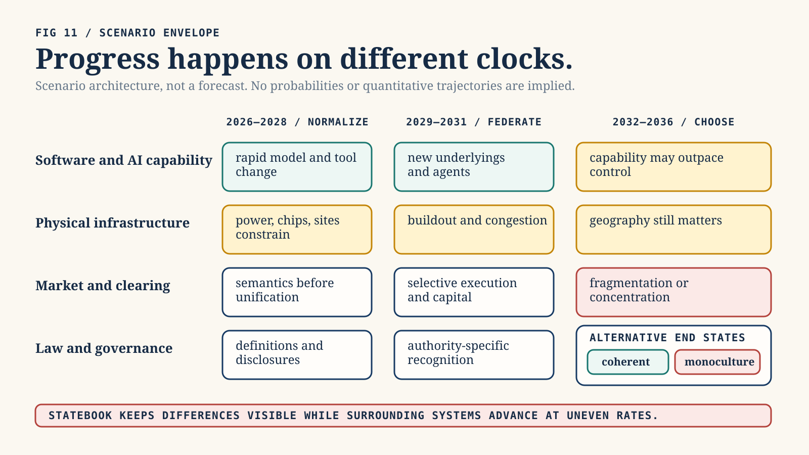

*Figure 11. AI capability, physical infrastructure, market structure, and law advance at different speeds; this is a scenario envelope, not a forecast. Original explanatory architecture illustration; not evidence of implementation, authority, or market fact.*

#### 2026-2028: normalization before unification

Likely developments:

- more venues add unfamiliar perpetual, event, tokenized, compute, and energy
  references;
- institutional and onchain products overlap in user intent but retain separate
  collateral and legal domains;
- AI assists contract ingestion and anomaly detection, with deterministic
  review still required;
- demand grows for shared contract semantics and provenance;
- security policy starts distinguishing fast internal state from delayed
  externalization;
- regulatory classification and benchmark governance remain product-specific.

The practical Statebook opportunity is read-only: normalize terms, find
candidate relations, expose residuals, and generate auditable completeness
reports.

#### 2029-2031: federated execution and selective capital recognition

Plausible developments:

- compute and energy benchmarks become more standardized but remain locational;
- cross-venue intent routing and linked settlement mature for bounded asset
  pairs;
- some clearing or prime-broker arrangements recognize selected cross-product
  offsets;
- policy engines use current evidence to govern externalization caps and
  challenge windows;
- AI agents become major proposal and liquidity actors but remain bounded by
  explicit authority and loss budgets;
- correlated infrastructure and model providers become a major prudential
  concern.

The product challenge shifts from mapping to governed federation. Statebook can
propose linked portfolios, but recognized capital and finality remain authority-
specific.

#### 2032-2036: market substrate or systemic monoculture

Two paths are plausible:

- **Coherent federation:** open semantic standards, portable evidence, diverse
  execution, interoperable settlement, explicit legal mappings, and bounded
  assurance policies let new risk markets compose without one universal venue.
- **Systemic monoculture:** a few cloud, model, oracle, clearing, and settlement
  providers dominate. Apparent efficiency masks correlated governance,
  operational, cyber, and liquidity failure.

The difference is not whether infrastructure becomes programmable. It is
whether semantic and authority boundaries remain inspectable as programmability
scales.

## 12. Product architecture

### 12.1 Layers

The proposed product has six layers:

1. **Source layer:** venue terms, standards, benchmarks, legal references,
   market observations, and evidence, each with provenance and version.
2. **Semantic layer:** validated terminal contracts, StateKeys, payoff functions,
   and explicit non-equivalences.
3. **Risk layer:** residual analysis, typed completeness, conservative valuation,
   and scenario stress.
4. **Assurance layer:** current evidence resolution, hard gates, linked-plan and
   obligation validation, exposure budgets, queue, and audit decisions.
5. **Recovery layer:** all-path stop, in-flight reconciliation, immutable
   evidence, restored liabilities, root rotation, incident replay, and canary
   reopening.
6. **Authority layer:** separately governed execution, clearing, custody, pause,
   signing, and settlement systems. This layer is outside the first product.

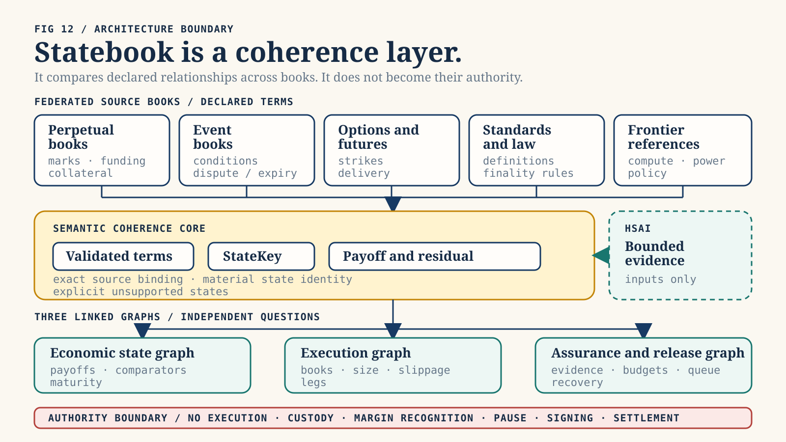

*Figure 12. Federated source terms converge into a semantic core and fan out to economic, execution, and assurance/release graphs; authority stays separately governed. Original explanatory architecture illustration; not evidence of implementation, authority, or market fact.*

### 12.2 Proposed modules

- `statebook-core`: financial terms, StateKey, exact payoff and residual,
  semantic and payoff completeness, and the common typed-result vocabulary.
- `statebook-settlement`: execution, capital, settlement, assurance, and
  recovery completeness; assurance observations; valuation; linked plans;
  obligations; budgets; queue; recovery; and one transition kernel. The kernel
  composes all seven results without allowing either module to fabricate the
  other's evidence.
- `statebook-hsai`: narrow evidence and decision-envelope adapters.
- `statebook-sim`: deterministic clocks, scenarios, attacker actions, sweeps,
  and counterexamples.
- `statebook-report`: digest-bound manifests, readback validation, nonclaims,
  and portable audit bundles.

These are future module boundaries, not currently authorized crates. The first
code phase requires a separately approved state slice.

### 12.3 Deep interface: one settlement transition kernel

Queue and budget mutations must not be coordinated by callers. One kernel owns
the atomic state transition:

```text
decide_and_transition(request, current_state)
  -> rejected | quarantined | immediate | queued | frozen
```

Its output binds contract, residual, completeness, evidence, policy, valuation,
linked-plan or obligation, ledger before/after tips, queue transition, reasons,
and nonclaims. The output is a decision record. It is not an execution command.

### 12.4 Evidence and media registry

Every external item records stable URL or commit, author or publisher,
publication and retrieval time, digest when captured, license or quotation
basis, evidence class, supported claims, limitations, and admissibility. Tweets,
screenshots, podcasts, and memes default to `IllustrativeNarrative`. They never
influence price, assurance, solvency, finality, or settlement unless promoted
through a separately specified capture and review process.

The SVG diagrams and memes in this publication are original explanatory assets.
They contain no copied commercial meme template or third-party logo.

## 13. Business and governance model

### 13.1 Likely users

- traders and treasury teams seeking cross-product hedges;
- venues and brokers seeking semantic routing and product discovery;
- clearing and margin teams evaluating bounded offset recognition;
- risk, legal, and compliance teams reviewing basis and finality;
- protocol and exchange security teams governing externalization;
- researchers and regulators inspecting new frontier-risk markets;
- AI agents proposing, but never authorizing, structured exposures.

### 13.2 Product wedge

The lowest-risk commercial wedge is a read-only coherence terminal and API:

- ingest a bounded set of source terms;
- show normalized differences;
- compare terminal payoffs;
- produce exact or approximate residual reports;
- display all seven completeness dimensions;
- simulate assurance-adjusted externalization policies;
- export an audit bundle.

This creates value before custody, execution, margin, or settlement authority.
Later products can add venue adapters, intent routing, or policy integration only
after separate evidence and authorization.

### 13.3 Economic model

Potential revenue surfaces include enterprise data and API subscriptions,
normalization and benchmark-governance tooling, simulation and audit products,
venue integration, and separately governed execution-intent fees. The business
must avoid incentives that reward labeling more portfolios as equivalent or
more releases as safe. Accuracy, explicit unknowns, and counterexample discovery
are product outputs, not friction to hide.

### 13.4 Governance

Governance separates:

- schema and semantic-profile changes;
- benchmark and source-root changes;
- valuation and risk-model changes;
- settlement policy and cap changes;
- emergency tightening;
- authority integrations.

Every change has a digest, effective time, review record, rollback rule, and
claim boundary. Emergency paths may narrow or freeze a bounded lane. Expansion
of value release requires timelock and evidence.

## 14. Implementation sequence

### Phase 0 — publication boundary

This paper, the source index, PRD, media, and verified PDFs. No runtime capability.

### Phase 1 — terminal semantic fixtures

Define bounded scalar cash-settled fixtures, exact quantities, source digests,
normalization profiles, StateKey golden vectors, and negative cases. No live
adapters.

### Phase 2 — payoff and residual engine

Implement exact rational terminal payoff comparison over finite declared state
domains. Report unsupported states and residual classes. No execution.

### Phase 3 — completeness reports

Add hermetic book, clearing, settlement, evidence, and recovery fixtures. Return
seven typed dimensions. No global boolean and no capital recognition claim.

### Phase 4 — deterministic settlement simulation

Implement assurance resolution, conservative valuation, multi-axis exactly-once
budgets, linked-plan validation, obligation validation, queue transitions,
hysteresis, and adversarial scenarios under an injected clock. No value moves.

### Phase 5 — evidence adapters and audit bundles

Add narrow HSAI and fixture adapters, digest-bound decision records, portable
reports, readback validation, and explicit nonclaims. No live venue authority.

### Phase 6 — read-only external adapters

After separate authorization, ingest live or captured venue terms and market
data without trading. Validate source identity, version, schema, and provenance.

### Phase 7 — separately owned authority integration

Execution, custody, clearing, pause, signing, margin, or settlement requires a
new threat model, legal review, operational evidence, loss limits, and authority
boundary. It is not implied by completing prior phases.

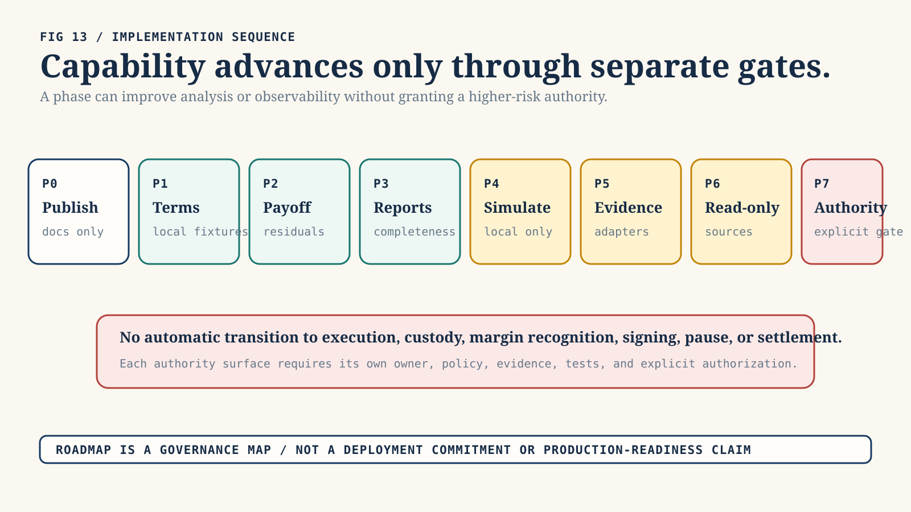

*Figure 13. Analysis capability progresses through separately bounded phases; no prior phase grants execution, custody, margin, signing, pause, or settlement authority. Original explanatory architecture illustration; not evidence of implementation, authority, or market fact.*

## 15. Evaluation and falsification

A Statebook thesis is useful only if it can fail visibly. Required evaluation
includes:

- semantic-equivalence precision and recall on a reviewed fixture corpus;
- independent StateKey golden-vector agreement;
- exact residual recomputation and permutation invariance;
- unsupported-state detection rate;
- execution-feasibility error under retained book snapshots;
- false capital-recognition rate, whose target is zero;
- hard-gate bypass count, whose target is zero;
- pending-PnL reuse count, whose target is zero;
- cap split-resistance across account, asset, destination, route, and venue;
- exactly-once ledger behavior under concurrency;
- partial linked-leg execution count, whose target is zero in the model;
- queue release without fresh evidence count, whose target is zero;
- false-positive freeze duration and legitimate-liquidity cost;
- incident detection, validation, and intervention latency distributions;
- counterexample minimization and deterministic replay;
- report readback integrity and claim-boundary compliance.

Rejection criteria include:

- term normalization cannot reach acceptable reviewed accuracy;
- equivalence false positives cannot be bounded;
- the residual model depends on unobservable or unstable state;
- exposure budgets can be expanded by splitting or correlated roots;
- controls materially increase insolvency or liquidation risk;
- operators cannot explain or reproduce decisions;
- legal or clearing authorities cannot use the semantic representation;
- the business requires hiding unknowns or overstating safety.

No production threshold or parameter is selected in this paper.

## 16. Required invariants

1. Every mutation names the exact state slice it touches.
2. Source terms remain digest-bound to every normalized contract.
3. Material term differences cannot share a StateKey.
4. Unsupported states cannot produce `Exact` payoff status.
5. Perpetual path dependence cannot disappear through terminal relabeling.
6. No completeness dimension implies another; specifically, payoff completeness
   does not imply semantic, execution, capital, settlement, assurance, or
   recovery completeness.
7. Missing observations remain `Unknown` or `NotObserved`, never `Pass`.
8. A higher evidence maturity cannot substitute for the wrong property.
9. Any failed or unknown applicable hard gate yields zero instant release.
10. Pending anomalous value supplies zero collateral, borrowing, margin-reuse,
    or release capacity.
11. All externalizing classes consume applicable gross native and common caps.
12. Inbound linked legs do not replenish outbound capacity in the same action.
13. A linked plan executes all legs or none.
14. A risk-reducing obligation cannot become a general withdrawable balance.
15. Ledger mutation is exactly-once against one expected tip.
16. Timer expiry alone cannot release value or exposure.
17. Finality or independently validated no-outflow evidence is required before
    in-flight exposure leaves the ledger.
18. Risk can tighten immediately; relaxation requires a successor policy and
    controlled delay.
19. Decision records do not become execution authority.
20. Social media, screenshots, interviews, and memes remain narrative context
    unless separately promoted through evidence governance.

## 17. Limitations and nonclaims

This paper does not claim:

- that Statebook is implemented;
- exhaustive literature coverage;
- that any two listed contracts are economically or legally equivalent;
- that a candidate portfolio is executable;
- that a clearinghouse recognizes an offset;
- that an oracle, venue, bridge, benchmark, custodian, or evidence provider is
  correct or solvent;
- that mandatory delay would have prevented the Ostium incident;
- that the final Ostium root cause or loss is known;
- that a particular trust-to-settlement ratio is empirically calibrated;
- that the AI and macro scenarios are forecasts;
- that attestation, signatures, ZK proofs, reputation, or HSAI establish market
  truth, solvency, legal rights, or semantic correctness;
- custody, execution, pause, routing, signing, margin, liquidation, or settlement
  authority;
- production readiness, full security, benchmark evidence, SOTA, or independent
  reproduction.

## 18. Conclusion

The order book remains essential, but its unit of coherence is one identified
contract. Frontier-risk markets require a higher layer because many contracts
now describe related fragments of the same world while retaining different
payoffs, paths, books, collateral regimes, and finality domains.

Statebook's central discipline is separation. Semantic identity is not payoff
replication. Replication is not execution. Execution is not recognized capital.
Atomic settlement is not legal finality. Attestation is not financial truth.
Reputation is not current authorization. Delay is not security unless it covers
every irreversible path and preserves the internal actions needed to remain
solvent.

The viable “AWS of finance” is therefore not the venue that lists the most
products. It is the substrate that lets many products compose while keeping
their residuals, evidence, authority, and failure domains visible. If that
substrate cannot say `Unknown`, it is not coherent. It is merely fast.

## References and provenance

The complete annotated bibliography, code references, incident evidence,
media classification, and source limitations are in
`docs/statebook-literature-source-index.md`. The governing design boundary is
`docs/integrations/statebook_terminal_payoff_and_trust_settlement.md`. Every
external fact in this paper is an observation-time claim as of 15 July 2026 and
may be superseded.
